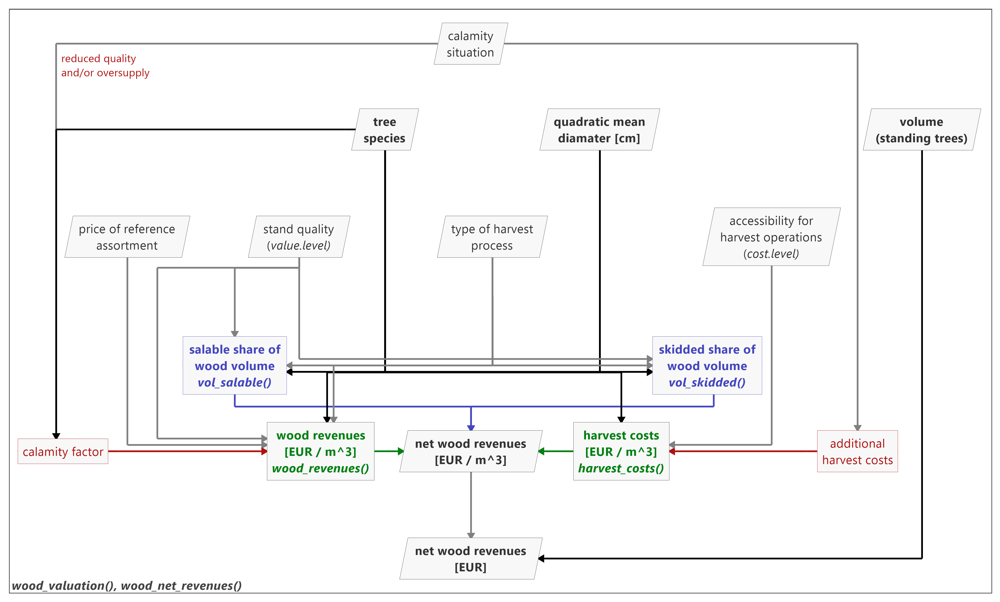
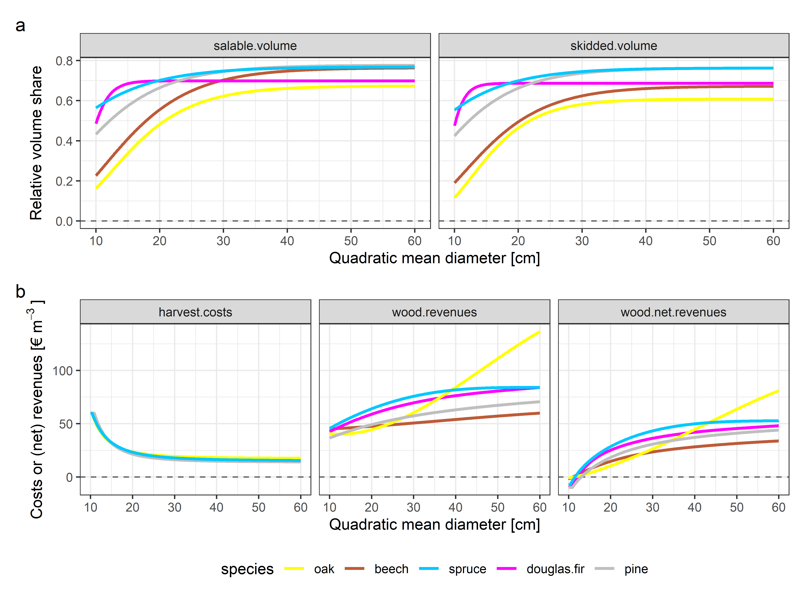
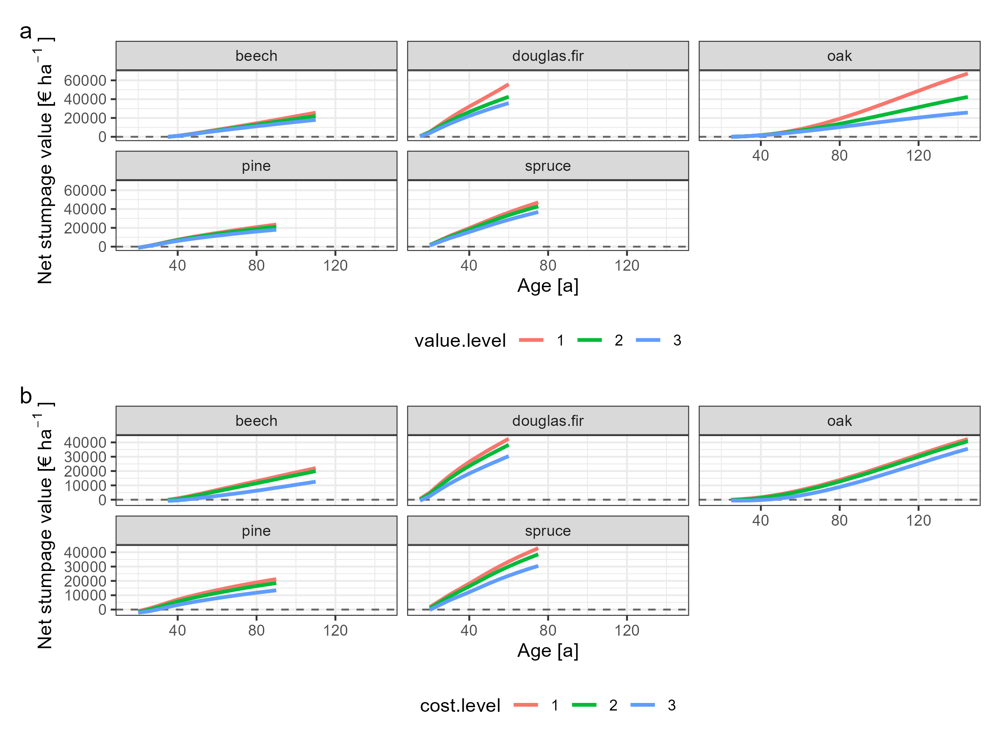
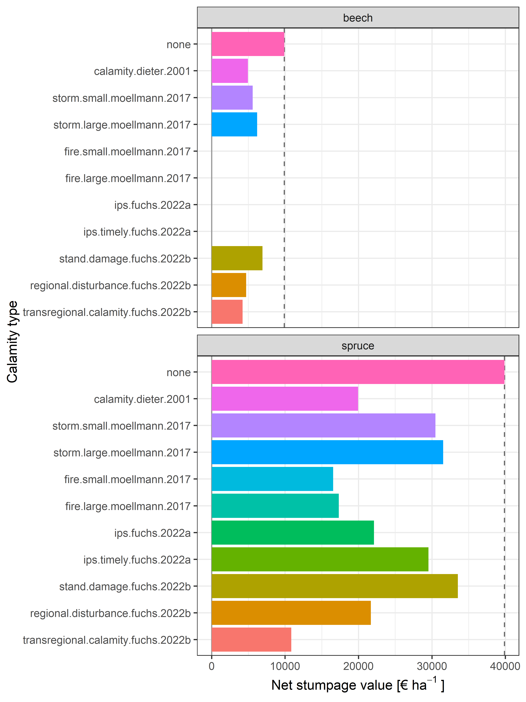

woodValuationDE
===================================

A package for the monetary valuation of wood in German forests (stumpage
values), including estimations of harvest quantities, wood revenues, and harvest
costs. The functions are sensitive to tree species, mean diameter of the
harvested trees, stand quality, and logging method. The functions include
estimations for the consequences of disturbances on revenues and costs.

The underlying assortment tables are taken from Offer and Staupendahl (2018)
with corresponding functions for salable and skidded volume derived in Fuchs et
al. (in preparation). Wood revenue and harvest cost functions were taken from v.
Bodelschwingh (2018). The consequences of disturbances refer to Dieter (2001),
Möllmann and Möhring (2017), and Fuchs et al. (2022a, 2022b). For the full
references see documentation of the functions, package README, and Fuchs et al.
(in preparation). Apart from Dieter (2001) and Möllmann and Möhring (2017),
all functions and factors are based on data from HessenForst, the forest
administration of the Federal State of Hesse in Germany.

<h1><a name="menu"></a></h1>

1. <a href="#introduction">Introduction</a>
2. <a href="#structure">Package structure</a>
3. <a href="#functions">Functions</a>
   * <a href="#fct_vol_salable">vol_salable()</a>
   * <a href="#fct_vol_skidded">vol_skidded()</a>
   * <a href="#fct_wood_revenues">wood_revenues()</a>
   * <a href="#fct_harvest_costs">harvest_costs()</a>
   * <a href="#fct_wood_valuation">wood_valuation()</a>
   * <a href="#fct_wood_net_revenues">wood_net_revenues()</a>
   * <a href="#fct_get_species_codes">get_species_codes()</a>
4. <a href="#example">Tutorial with yield tables</a>
5. <a href="#citation">Recommended citation</a>
6. <a href="#references">References</a>

<h1><a name="introduction">Introduction</a></h1>

When assessing the multiple ecosystem services provided by German forests,
economic indicators for productive ecosystem services are relevant but are not
always easily estimable. Their calculation requires either quantitative
information or many assumptions on them and is time consuming. The net wood
revenues, as a basis for several indicators related to income from wood
production, depend, a.o., on tree species, diameter, and stand quality.
Additionally, disturbance events may affect the net revenues, as wood quality
is reduced due to mechanical damage, market prices are reduced due to increasing
wood supply, and harvest costs might increase
[(Fuchs et al. 2022b)](#fuchs.2022b).

Here, <strong>woodValuationDE</strong> contributes with a comprehensive wood
valuation framework considering the various influences on 
<em>harvest quantities</em>, <em>harvest costs</em>, and <em>wood
revenues</em>. It simplifies the estimation of realistic monetary wood values
for a broad field of applications in bioeconomic modeling. A particular strength
of <strong>woodValuationDE</strong> is the consistency of the data underlying
the various models, including a set of disturbance scenarios.

<strong>woodValuationDE</strong> comprises data and models obtained from several
studies. It makes previously published models available for future studies by
creating a consistent valuation framework since
all<sup>[1](#fndieter),[2](#fnmoellmann)</sup> submodels are based on
operational harvest and sale data from HessenForst, the public forest service of
the Federal State of Hesse in Germany. The underlying assortment tables are
taken from [Offer and Staupendahl (2018)](
#offer.2018) with corresponding functions for the harvest quantities derived in
[Fuchs et al. (in preparation)](#fuchs.inpreparation). Wood revenue and harvest
cost functions were taken from [v. Bodelschwingh (2018)](#vbodelschwingh.2018).
The consequences of disturbances refer to [Dieter (2001)](
#dieter.2001)<sup>[1](#fndieter)</sup>, [Möllmann and Möhring (2017)](
#moellmann.2017)<sup>[2](#fnmoellmann)</sup>, [Fuchs et al. (2022a)](
#fuchs.2022a), and [Fuchs et al. (2022b)](#fuchs.2022b).

The assortment tables as well as the other models in
<strong>woodValuationDE</strong> represent average conditions in Hesse. The
estimations usually represent a strong simplification, since the variability of
these values is very large in practice. Furthermore, the assortment tables
assume the harvest of entire stands, which must be considered when revenues for
harvests of smaller parts of stands are estimated.

---

<strong>
For the full information on the underlying models and a discussion of the
limitations of <strong>woodValuationDE</strong>, we refer the readers to the
technical note:
</strong>

[Fuchs et al. (in preparation)](#fuchs.inpreparation)

<em>We will add the full reference once the manuscript is published.</em>

<strong>
We encourage users to conduct sensitivity analyses and to review the default
parameters and modify them where necessary.
</strong>

---

<i><sup><a id="fndieter">1</a></sup>The assumed factor according to
[Dieter (2001)](#dieter.2001) is an exception since it is based on wood prices
in southern Germany. However, we included it since it has often been applied in
bioeconomic simulations for Germany.</i>

<i><sup><a id="fndieter">2</a></sup>The assumed factors according to
[Möllmann and Möhring (2017)](#moellmann.2017) are an exception since they are
based on surveys of forest owners and managers in the entirety of Germany.
However, we included them, since they provide estimates distinguishing
between the disturbance agents.</i>

<h1><a name="structure">Package structure</a></h1>

The wood valuation implemented in <strong>woodValuationDE</strong> is a
three-stage approach, deriving (i) the relevant harvest quantities, (ii) the
revenues and costs per volume unit, and (iii) the net revenues (see Fig. 1).

<figure align="center">
  
  <figcaption>
    <i>Fig. 1:</i> Structural outline of
    <strong>woodValuationDE</strong> with user input and output as well as the
    main functions. Font: bold: main elements, italics: functions. Color: blue:
    function derived in Fuchs et al. (in preparation) based on Offer and
    Staupendahl (2018), green: functions taken from v. Bodelschwingh (2018),
    red: calamity factors derived in Dieter (2001), Möllmann and Möhring
    (2017), and Fuchs et al. (2022a, 2022b). Box shape: rectangle: functions
    and factors, parallelogram: user input and output.
  </figcaption>
</figure>

<br><strong>woodValuationDE</strong> allows for the estimation of wood values
referring to the volume over bark of the standing trees to be harvested (German
unit: Vfm m.R.) as usually provided by yield tables and single-tree simulation
models. Volume losses due to harvest cuts and residues (in German: X-Holz and
NVD-Holz), e.g., due to fixed assortment length, are considered via the 
harvest quantity functions: <a href="#fct_vol_salable"><em>vol_salable()</em></a>
provides the share of salable volume relative to the volume over bark. It
represents the volume that is utilized and taken out of the forest stand. It is
the relevant volume unit for the revenues. It includes all pulpwood, sawlogs, and
private fuel wood.
<a href="#fct_vol_skidded"><em>vol_skidded()</em></a> provides the share of
skidded volume relative to the volume over bark. This volume share is delivered
to the forest road and represents the relevant volume unit for remuneration for
the logging (harvesting and skidding), i.e. the harvest costs. The salable
volume is higher than the skidded volume since it also includes the private
fuel wood, which is not delivered to the forest road by the forest enterprise.

Accordingly, <a href="#fct_wood_revenues"><em>wood_revenues()</em></a> estimates
the revenues per cubic meter of salable wood [EUR m<sup>-3</sup>] and
<a href="#fct_harvest_costs"><em>harvest_costs()</em></a> the harvest costs per
cubic meter of skidded wood [EUR m<sup>-3</sup>]. Both models depend on the tree
species and quadratic mean diameter<sup>[3](#fndq)</sup> of the harvested trees.
Further function arguments are the stand quality, the logging method, and the
accessibility of the stand for logging operations. In addition, current
market situations can be considered via updated prices for the German reference
assortments.

The functions <a href="#fct_wood_valuation"><em>wood_valuation()</em></a> and
<a href="#fct_wood_net_revenues"><em>wood_net_revenues()</em></a> provide
wrappers for easy application of the wood valuation procedure implemented in
<strong>woodValuationDE</strong>. Both functions call the previously described
ones and combine them to derive the net wood revenues. While
<a href="#fct_wood_valuation"><em>wood_valuation()</em></a> returns a tibble
with the entire calculations,
<a href="#fct_wood_net_revenues"><em>wood_net_revenues()</em></a> can be used to
directly get the total net revenues [EUR].

In the next section, we describe the functions' input arguments and output
values as well as the underlying models and data with their references in more
detail. The parameters for all models are stored as internal object
<em>params.wood.value</em>. Users interested in the detailed parameters can call
them via:

``` r
woodValuationDE:::params.wood.value
```

<i><sup><a id="fndq">3</a></sup>The mean diameter is calculated as the
diameter corresponding to the mean single-tree basal area (at breast
height) of the harvested trees, often referred to as QMD, D<sub>q</sub>,
or D<sub>g</sub> (see e.g. [Curtis and Mashall (2000)](#curtis.2000)). In
German: Durchmesser des Grundflächenmittelstamms.</i>

<h1><a name="functions">Functions, models, and underlying data</a></h1>

<h2><em><a name="fct_vol_salable">vol_salable()</a></em></h2>

The function estimates the salable share in the volume over bark of the
standing trees that are to be harvested. This includes pulpwood,
sawlogs, but also private fuel wood. It represents the entire share
of wood which is taken out of the forest for usage. The share of salable
wood is required to  derive the wood revenues per unit volume over bark.
The function is based on the assortment tables from
[Offer and Staupendahl (2018)](#offer.2018) and its derivation is
described in [Fuchs et al. (inpreparation)](#fuchs.inpreparation). The
underlying assortment tables are based on data from HessenForst, the
public forest service of the Federal State of Hesse in Germany.

<h3>Data and model</h3>

The assortment tables from [Offer and Staupendahl (2018)](#offer.2018)
provide conversion factors from the volume over bark (in German: Vfm m.R.) to
the harvested volume under bark (in German: Efm o.R.). In addition, they provide
the share of non-utilized wood, e.g., due to fixed assortment lengths, and
private fuel wood thereof. The assortment tables were derived for HessenForst
with the calculation program HOLZERNTE 7.1
[(Schöpfer et al., 2003)](#schopfer.2003). Additional parameters were defined by
forest district officers and validated against harvest and sale statistics of
HessenForst. More details on the assortment tables and their derivation
are provided in [Offer and Staupendahl (2008)](#offer.2008) and
[Offer and Staupendahl (2009)](#offer.2009).

We derived the share of salable volume <i>v<sub>salable</sub></i> based on these
assortment tables. Since the assortment tables only provide the values in
diameter steps of 2 cm, a Gompertz function was fitted in order to have a
continuous model (see
[Fuchs et al., in preparation](#fuchs.inpreparation)). For the model
fitting, the modified formulation according to
[Fischer and Schönfelder (2017)](#fischer.2017) was used:

<p align="center">
  <i>v<sub>salable</sub></i> = <i>A</i> * exp( -exp(
  <i>z<sub>m</sub></i> / <i>A</i> * exp(1) * (<i>t<sub>w</sub></i> -
  <i>d<sub>q</sub></i>))),
</p>

with the volume share of salable wood <i>v<sub>salable</sub></i>, the
quadratic mean diameter <i>d<sub>q</sub></i>, and the parameters
<i>A</i>, <i>z<sub>m</sub></i> and <i>t<sub>w</sub></i>. The actual parameter
values depend on tree species, stand quality, and logging method.

<h3>Input</h3>

Apart from <i>species.code.type</i>, all user inputs can be provided as
single values or as a vector. If mixed, the single values will be
recycled.

<h4><i>diameter.q</i></h4>

The quadratic mean<sup>[3](#fndq)</sup> of the diameter at breast height
(dbh) of the harvested trees [cm].

<h4><i>species</i></h4>

The tree species, using one of the available <i>species.code.type</i>s.
<a href="#tab1">Tab. 1</a> lists the most important genera and species
implemented. Most species are assigned to economic species groups for
valuation. A list of available species codes and their assignments
to economic valuation groups is provided by:

``` r
get_species_codes()
```

<br>

<p align="center" id="tab1">
  <i>Tab. 1:</i> Most important species codes and genera available in
  <strong>woodValuationDE</strong> with their English and Lower Saxony
  species codes.
</p>

| Species code Lower Saxony | English species Code | Scientific name               |
|---------------------------|----------------------|-------------------------------|
| 110                       | oak                  | <i>Quercus</i> sp.            |
| 211                       | beech                | <i>Fagus sylvatica</i>        |
| 221                       | hornbeam             | <i>Carpinus betulus</i>       |
| 311                       | ash                  | <i>Fraxinus excelsior</i>     |
| 321                       | maple                | <i>Acer pseudoplatanus</i>    |
| 331                       | elm                  | <i>Ulmus glabra</i>           |
| 341                       | lime                 | <i>Tilia platyphyllos</i>     |
| 354                       | cherry               | <i>Prunus avium</i>           |
| 410                       | birch                | <i>Betula</i> sp.             |
| 421                       | alder                | <i>Alnus glutinosa</i>        |
| 430                       | poplar               | <i>Populus</i> sp.            |
| 441                       | willow               | <i>Salix</i> sp.              |
| 511                       | spruce               | <i>Picea abies</i>            |
| 521                       | fir                  | <i>Abies alba</i>             |
| 611                       | douglas.fir          | <i>Pseudotsuga menziesii</i>  |
| 711                       | pine                 | <i>Pinus sylvestris</i>       |
| 811                       | larch                | <i>Larix decidua</i>          |

<h4><i>value.level</i></h4>

Stand quality, expressed as an integer value of 1:3:

* <i>1</i>: extraordinarily high stand quality with high shares of wood
  suitable, e.g., for furniture
* <i>2</i>: moderate quality
* <i>3</i>: low quality (e.g. trees with thick branches)

The <i>value.levels</i> refer to the applied assortment tables
[(Offer and Staupendahl, 2018)](#offer.2018).

<h4><i>logging.method</i></h4>

Logging method:

* <i>"manually"</i>: motor-manual logging using a chain saw
* <i>"harvester"</i>: highly mechanized logging using forest harvesters
* <i>"combined"</i>: a combination of the previous methods dependent on
  the mean diameter
  
The logging methods <i>"manually"</i> and <i>"harvester"</i> refer to
[Offer and Staupendahl (2018)](#offer.2018) and
[v. Bodelschwingh (2018)](#vbodelschwingh.2018). Since, e.g., for
deciduous species a maximum diameter of 40 cm is assumed for highly
mechanized logging,
[Fuchs et al. (in preparation)](#fuchs.inpreparation) derived the method
<i>"combined"</i>. This refers to combinations, as applied by
[v. Bodelschwingh (2018)](#vbodelschwingh.2018) in the harvest cost
model, assuming diameter-specific proportions of motor-manual and highly mechanized
logging:

* softwood species
  + <i>diameter.q</i> <= 20 cm: 100 % <i>"harvester"</i>,
  + 20 cm < <i>diameter.q</i> < 50 cm: linear increase of
    <i>"manually"</i>, maximum 50 %,
  + diameter.q</i> >= 50 cm: 50 % <i>"harvester"</i> and 50 %
    <i>"manually"</i>.
* deciduous species
  + <i>diameter.q</i> <= 20 cm: 100 % <i>"harvester"</i>,
  + 20 cm < <i>diameter.q</i> < 40 cm: linear increase of
    <i>"manually"</i>, maximum 100 %,
  + diameter.q</i> >= 40 cm: 100 % <i>"manually"</i>.

<h4><i>species.code.type</i></h4>

The type of code in which <i>species</i> is given.

* "en"</i>: English species names
* "nds"</i>: numeric species codes used in Lower Saxony, Germany.

The list with the available species' codes is provided by:

``` r
get_species_codes()
```

<h3>Output</h3>

A vector with relative shares of salable wood volume (relative share,
not percentages).

<h3>Application</h3>

``` r
vol_salable(40,
            "beech")

# species codes Lower Saxony (Germany)
vol_salable(40,
            211,
            species.code.type = "nds")

# vector input
vol_salable(seq(20, 50, 5),
            "spruce")

vol_salable(rep(seq(20, 50, 10),
                2),
            rep(c("beech", "spruce"),
                each = 4))

vol_salable(rep(seq(20, 50, 10),
                2),
            rep(c("beech", "spruce"),
                each = 4),
            logging.method = rep(c("manually", "harvester"),
                               each = 4))
```

<h2><em><a name="fct_vol_skidded">vol_skidded()</a></em></h2>

The function estimates the skidded share in the volume over bark of the
standing trees that are to be harvested. It is entire volume that is assumed to
be commercially delivered to the forest road, the pulpwood and sawlog
assortments. The share of skidded wood is required to derive the harvest costs
per unit volume over bark. The function is based on the assortment tables from
[Offer and Staupendahl (2018)](#offer.2018) and its derivation is described in
[Fuchs et al. (in preparation)](#fuchs.inpreparation). The underlying assortment
tables are based on data from HessenForst, the public forest service of the
Federal State of Hesse in Germany.

<h3>Data and model</h3>

The assortment tables from
[Offer and Staupendahl (2018)](#offer.2018) provide conversion factors
from volume over bark to harvested volume under bark. In addition, they provide
the share of non-utilized wood, e.g., due to fixed assortment lengths, and
private fuelwood thereof. The assortment tables were derived for HessenForst
with the calculation program HOLZERNTE 7.1
[(Schöpfer et al., 2003)](#schopfer.2003). Additional parameters were defined by
forest district officers and validated against harvest and sale statistics of
HessenForst. More details on the assortment tables and their derivation
are provided in [Offer and Staupendahl (2008)](#offer.2008) and
[Offer and Staupendahl (2009)](#offer.2009).

We derived the share of skidded volume <i>v<sub>skidded</sub></i> based on these
assortment tables. Since the assortment tables only provide the values in
diameter steps of 2 cm, a Gompertz function was fitted to have a continuous
model (see [Fuchs et al., in preparation](#fuchs.inpreparation)). For the model
fitting, the modified formulation according to
[Fischer and Schönfelder (2017)](#fischer.2017) was used:

<p align="center">
  <i>v<sub>skidded</sub></i> = <i>A</i> * exp( -exp(
  <i>z<sub>m</sub></i> / <i>A</i> * exp(1) * (<i>t<sub>w</sub></i> -
  <i>d<sub>q</sub></i>))),
</p>

with the volume share of skidded wood <i>v<sub>skidded</sub></i>, the
quadratic mean diameter <i>d<sub>q</sub></i>, and the parameters
<i>A</i>, <i>z<sub>m</sub></i> and <i>t<sub>w</sub></i>. The actual parameter
values depend on species, stand quality, and logging method.

<h3>Input</h3>

Apart from <i>species.code.type</i>, all user inputs can be provided as
single values or as a vector. If mixed, the single values will be
recycled.

<h4><i>diameter.q</i></h4>

<h4><i>species</i></h4>

<h4><i>value.level</i></h4>

<h4><i>logging.method</i></h4>

<h4><i>species.code.type</i></h4>

For details see <a href="#fct_vol_salable">vol_salable()</a>.

<h3>Output</h3>

A vector with relative shares of skidded wood volume (relative share,
not percentages).

<h3>Application</h3>

``` r
vol_skidded(40,
            "beech")

# species codes Lower Saxony (Germany)
vol_skidded(40,
            211,
            species.code.type = "nds")

# vector input
vol_skidded(seq(20, 50, 5),
            "spruce")

vol_skidded(rep(seq(20, 50, 10),
                2),
            rep(c("beech", "spruce"),
                each = 4))

vol_skidded(rep(seq(20, 50, 10),
                2),
            rep(c("beech", "spruce"),
                each = 4),
            logging.method = rep(c("manually", "harvester"),
                               each = 4))
```

<h2><em><a name="fct_wood_revenues">wood_revenues()</a></em></h2>

The function estimates average wood revenues per unit salable volume
[EUR m<sup>-3</sup>] applying the wood revenues model of
[v. Bodelschwingh (2018)](#vbodelschwingh.2018), which is based on the
assortment tables from [Offer and Staupendahl (2018)](#offer.2018).
Consequences of calamities are implemented based on
[Dieter (2001)](#dieter.2001),
[Möllmann and Möhring (2017)](#moellmann.2017),
[Fuchs et al. (2022a)](#fuchs.2022a), and
[Fuchs et al. (2022b)](#fuchs.2022b). Apart from
[Dieter (2001)](#dieter.2001) and
[Möllmann and Möhring (2017)](#moellmann.2017), the function and all
factors are based on data from HessenForst, the public forest service of
the Federal State of Hesse in Germany.

<h3>Data and model</h3>

The diameter- and species-sensitive wood revenue model was developed by
[v. Bodelschwingh (2018)](#vbodelschwingh.2018). It is based on a
previous version (2013) of the assortment tables of
[Offer and Staupendahl (2018)](#offer.2018) and the wood sales of
HessenForst from 2010 to 2015. A price matrix for different assortments
was derived out of the sales data and combined with the assortment table
to derive average wood revenues for diameter-dependent assortment
compositions. The fitted model function for the wood revenues <i>s</i> is:

<p align="center">
  <i>s</i> = <i>a</i> * <i>d<sub>q</sub></i><sup>4</sup> +
  <i>b</i> * <i>d<sub>q</sub></i><sup>3</sup> + 
  <i>c</i> * <i>d<sub>q</sub></i><sup>2</sup> + 
  <i>d</i> * <i>d<sub>q</sub></i> + <i>e</i>,
</p>

with the quadratic mean diameter <i>d<sub>q</sub></i>, and the parameters
<i>a</i> to <i>e</i>. The parameter values depend on species, stand quality
(<em>value.level</em>), and logging method.

The model estimates wood revenues referring to Hessian market conditions
in the time period from 2010 to 2015. Via the market price of a reference
assortment for each species, this can be linearly adapted to other market
conditions. The reference assortments (sawlogs) are defined by
diameter class (1: 10-19 cm, 2: 20-29..., with 1a: 10-14 cm and 1b:
15-19 cm) and a quality from A to D (with A the highest and
D the lowest quality) as usually applied in Germany (see
[Deutscher Forstwirtschaftsrat and Deutscher Holzwirtschaftsrat, 2020](#deutscherforstwirtschaftsrat.2020)).
The original prices of the reference assortments
<i>p<sub>reference.assortment,original</sub></i> in Hesse between 2010
and 2015 are listed in <a href="#tab2">Tab.2</a>. If another price
<i>p<sub>reference.assortment,user</sub></i> is applied to
<a href="#fct_wood_revenues"><em>wood_revenues()</em></a>, the baseline
wood revenues of the model <i>s<sub>original</sub></i> will be updated
(<i>s<sub>updated</sub></i>) by:

<p align="center">
  <i>s<sub>updated</sub></i> =
  <i>p<sub>reference.assortment,user</sub></i> /
  <i>p<sub>reference.assortment,original</sub></i> *
  <i>s<sub>original</sub></i>.
</p>

<br>

<p align="center" id="tab2">
  <i>Tab. 2:</i> Prices of the reference assortments in Hesse between
  2010 and 2015, adapted from
  [v. Bodelschwingh (2018, Tab. 10)](#vbodelschwingh.2018).
</p>

| English Species Code | Reference Assortment | Price [EUR m<sup>-3</sup>] |
|----------------------|----------------------|---------------------------:|
| oak                  | B 4                  |                     277.41 |
| beech                | B 4                  |                      75.75 |
| spruce               | B 2b                 |                      92.47 |
| pine                 | B 2b                 |                      71.48 |
| douglas.fir          | B 2b                 |                      92.23 |
| larch                | B 2b                 |                      83.29 |
| birch                | B 4                  |                      72.13 |
| alder                | B 4                  |                      98.90 |
| ash                  | B 4                  |                     112.88 |
| poplar               | B 4                  |                      45.43 |

A particular strength of <strong>woodValuationDE</strong> is the possibility to
consider consequences of disturbances and calamities. Users can choose a
suitable parameterization from a broad set of previously published
estimates for the consequences of disturbances that are pre-implemented.
Alternatively, users can implement their own assumptions. For wood revenues, a
factor is multiplied with the undisturbed revenues. The options that are
implemented by default are listed in <a href="#tab3">Tab. 3</a>.

<br>

<p align="center" id="tab3">
  <i>Tab. 3:</i> Factors to reduce wood revenues for salvage 
  harvests that are implemented in <strong>woodValuationDE</strong>.
</p>

| Name          | Factor softwood | Factor deciduous | Reference          | Details                                 |
|:--------------|:---------------:|:----------------:|:-------------------|:----------------------------------------|
| <i>"none"</i>                    | 1.00     | 1.00      | \-                 | default: no calamity            |
| <i>"calamity.dieter.2001"</i>    | 0.50     | 0.50      | [Dieter (2001)](#dieter.2001)            | Assumption based on prices in southern Germany after a calamity event, often applied in bioeconomic simulations for Germany. Originally referring to net revenues, thus to be used in combination with <a href="#fct_harvest_costs"><em>harvest_costs()</em></a>. |
| <i>"fire.small.moellmann.2017"</i>    | 0.56     | \-        | [Möllmann and Möhring (2017)](#moellmann.2017)     | Based on a survey of forest managers in Germany, referring to damages by fire affecting only a few trees. The survey only asked for effects of quality losses. |
| <i>"fire.large.moellmann.2017"</i>    | 0.56     | \-        | [Möllmann and Möhring (2017)](#moellmann.2017) | Based on a survey of forest managers in Germany, referring to damages by fire affecting at least one compartment. The survey only asked for effects of quality losses. |
| <i>"storm.small.moellmann.2017"</i>   | 0.85     | 0.79      | [Möllmann and Möhring (2017)](#moellmann.2017) | Based on a survey of forest managers in Germany, referring to damages by storm affecting only a few trees. The survey only asked for effects of quality losses. |
| <i>"storm.large.moellmann.2017"</i>   | 0.85     | 0.79      | [Möllmann and Möhring (2017)](#moellmann.2017) | Based on a survey of forest managers in Germany, referring to damages by storm affecting at least one compartment. The survey only asked for effects of quality losses. |
| <i>"insects.moellmann.2017"</i>       | 0.78     | \-        | [Möllmann and Möhring (2017)](#moellmann.2017) | Based on a survey of forest managers in Germany, referring to damages by insects. The survey only asked for effects of quality losses. |
| <i>"ips.fuchs.2022a"</i>          | 0.67     | \-        | [Fuchs et al. (2022a)](#fuchs.2022a) | Assumption of quality losses after spruce bark beetle infestations, based on the assortment tables [(Offer and Staupendahl, 2018)](#offer.2018) and price matrix [(v. Bodelschwingh, 2018)](#vbodelschwingh.2018). |
| <i>"ips.timely.fuchs.2022a"</i>   | 0.88     | \-        | [Fuchs et al. (2022a)]( #fuchs.2022a) | Assumption of quality losses after spruce bark beetle infestations with timely salvage harvests leading to lower value losses, based on the assortment tables [(Offer and Staupendahl, 2018)](#offer.2018) and price matrix [(v. Bodelschwingh, 2018)](#vbodelschwingh.2018). |
| <i>"stand.damage.fuchs.2022b"</i>      | 0.90     | 0.85      | [Fuchs et al. (2022b)](#fuchs.2022b) | Assumption of damages in a single stand influencing only the wood quality not the wood market, derived based on time series analyses of sales of HessenForst. |
| <i>"regional.disturbance.fuchs.2022b"</i> | 0.74     | 0.70      | [Fuchs et al. (2022b)](#fuchs.2022b) | Assumption of regional damages influencing wood quality and regional wood market (oversupply), derived based on time series analyses of sales of HessenForst. |
| <i>"transregional.calamity.fuchs.2022b"</i> | 0.54     | 0.70      | [Fuchs et al. (2022b)](#fuchs.2022b) | Assumption of (inter-)national damages influencing wood quality and wood national market (oversupply), derived based on time series analyses of sales of HessenForst. |

<h3>Input</h3>

Apart from <i>species.code.type</i>, <i>price.ref.assortment</i>, and
<i>calamity.factors</i>, all user inputs can be provided as single
values or as a vector. If mixed, the single values will be recycled.

<h4><i>diameter.q</i></h4>

The quadratic mean<sup>[3](#fndq)</sup> of the diameter at breast height
(dbh) of the harvested trees [cm].

<h4><i>species</i></h4>

The tree species, using one of the available <i>species.code.type</i>s.
<a href="#tab1">Tab. 1</a> lists the most important genera and species
implemented. Most species are assigned to economic species groups for
valuation. A list of available species codes, and their assignments
to valuation groups is provided by:
      
``` r
get_species_codes()
```

<h4><i>value.level</i></h4>

Stand quality, expressed as an integer value of 1:3:

* <i>1</i>: extraordinarily high stand quality with high shares of wood
  suitable, e.g., for furniture
* <i>2</i>: moderate quality
* <i>3</i>: low quality (e.g. trees with thick branches)

The <i>value.levels</i> refer to the applied assortment tables
[(Offer and Staupendahl, 2018)](#offer.2018).

<h4><i>logging.method</i></h4>

Logging method:
    
* <i>"manually"</i>: motor-manual logging using a chain saw
* <i>"harvester"</i>: highly mechanized logging using forest harvesters
* <i>"combined"</i>: a combination of the previous methods dependent on
  the mean diameter
      
The logging methods <i>"manually"</i> and <i>"harvester"</i> refer to
[Offer and Staupendahl (2018)](#offer.2018) and
[v. Bodelschwingh (2018)](#vbodelschwingh.2018). Since, e.g., for
deciduous species a maximum diameter of 40 cm is assumed for highly
mechanized logging,
[Fuchs et al. (in preparation)](#fuchs.inpreparation) derived the method
<i>"combined"</i>. This refers to combinations, as applied by
[v. Bodelschwingh (2018)](#vbodelschwingh.2018) in the harvest cost
model, assuming diameter-specific proportions of motor-manual and highly mechanized
logging:
                
* softwood species
  + <i>diameter.q</i> <= 20 cm: 100 % <i>"harvester"</i>,
  + 20 cm < <i>diameter.q</i> < 50 cm: linear increase of
    <i>"manually"</i>, maximum 50 %,
  + diameter.q</i> >= 50 cm: 50 % <i>"harvester"</i> and 50 %
    <i>"manually"</i>.
* deciduous species
  + <i>diameter.q</i> <= 20 cm: 100 % <i>"harvester"</i>,
  + 20 cm < <i>diameter.q</i> < 40 cm: linear increase of
    <i>"manually"</i>, maximum 100 %,
  + diameter.q</i> >= 40 cm: 100 % <i>"manually"</i>.
  

<h4><i>price.ref.assortment</i></h4>

Wood price of the reference assortments allowing for the consideration
of market fluctuations as described above. Default is <i>"baseline"</i>,
which refers to the prices from 2010 to 2015 in Hesse, Germany according
to [v. Bodelschwingh (2018)](#vbodelschwingh.2018), listed in
<a href="#tab2">Tab. 2</a>. Alternatively, users can provide a
tibble with the same structure, which is illustrated by the
<i>"baseline"</i> tibble:

``` r
prices.ref.assortments <- dplyr::tibble(
      species = c(110, 211, 511, 711, 611,
                  811, 410, 421, 311, 430),
      price.ref.assortment = c(277.41, 75.75, 92.47, 71.48, 92.23,
                               83.29, 72.13, 98.90, 112.88, 45.43))
```

<h4><i>calamity.type</i></h4>

Type of calamity or disturbance event in case of salvage harvests. This
determines the applied reductions for salvage revenues. For the
implemented options, see <a href="#tab3">Tab.3</a>. Alternatively, users
can provide their own factors.

<h4><i>calamity.factors</i></h4>

Summands [EUR m<sup>-3</sup>] and factors to consider the consequences
of disturbances and calamities on wood revenues and harvest costs.
<i>"baseline"</i> provides a tibble based on the references listed in
<a href="#tab5">Tab. 5</a>. Alternatively, users can provide an own
tibble with the same structure, which is illustrated by the
<i>"baseline"</i> tibble:

``` r
calamity.factors <- dplyr::tibble(
      calamity.type = rep(c("none",
                            "calamity.dieter.2001",
                            "fire.small.moellmann.2017",
                            "fire.large.moellmann.2017",
                            "storm.small.moellmann.2017",
                            "storm.large.moellmann.2017",
                            "insects.moellmann.2017",
                            "ips.fuchs.2022a",
                            "ips.timely.fuchs.2022a",
                            "stand.damage.fuchs.2022b",
                            "regional.disturbance.fuchs.2022b",
                            "transregional.calamity.fuchs.2022b"),
                          each = 2),
      species.group = rep(c("softwood",
                            "deciduous"),
                          times = 12),
      revenues.factor = c(1.00, 1.00,
                          0.50, 0.50,
                          0.56,   NA,
                          0.56,   NA,
                          0.85, 0.79,
                          0.85, 0.79,
                          0.78,   NA,
                          0.67,   NA,
                          0.88,   NA,
                          0.90, 0.85,
                          0.74, 0.70,
                          0.54, 0.70),
      cost.factor = c(1.00, 1.00,
                      0.50, 0.50,
                      1.17,   NA,
                      1.09,   NA,
                      1.21, 1.24,
                      1.10, 1.12,
                        NA,   NA,
                      1.00,   NA,
                      1.00,   NA,
                      1.15, 1.15,
                      1.15, 1.15,
                      1.25, 1.25),
      cost.additional = c(0.0, 0.0,
                          0.0, 0.0,
                          0.0, 0.0,
                          0.0, 0.0,
                          0.0, 0.0,
                          0.0, 0.0,
                          0.0, 0.0,
                          2.5,  NA,
                          7.5,  NA,
                          0.0, 0.0,
                          0.0, 0.0,
                          0.0, 0.0)
    )
```

<h4><i>species.code.type</i></h4>

The type of code in which <i>species</i> is given.

* "en"</i>: English species names
* "nds"</i>: numeric species codes used in Lower Saxony, Germany.

The list with the available species' codes is provided by:

``` r
get_species_codes()
```

<h3>Output</h3>

A vector with wood revenues per unit volume [EUR m<sup>-3</sup>]. The
volume refers to the share of salable wood volume, which is provided by
<a href="#fct_vol_salable"><i>vol_salable()</i></a>.

<h3>Application</h3>

``` r
wood_revenues(40,
              "beech")

# species codes Lower Saxony (Germany)
wood_revenues(40,
              211,
              species.code.type = "nds")

# vector input
wood_revenues(seq(20, 50, 5),
              "spruce")

wood_revenues(40,
              rep(c("beech", "spruce"),
                  each = 3),
              value.level = rep(1:3, 2))

# with calamity
wood_revenues(40,
              rep("spruce", 7),
              calamity.type = c("none",
                                "calamity.dieter.2001",
                                "ips.fuchs.2022a",
                                "ips.timely.fuchs.2022a",
                                "stand.damage.fuchs.2022b",
                                "regional.disturbance.fuchs.2022b",
                                "transregional.calamity.fuchs.2022b"))

# user-defined calamities with respective changes in wood revenues
wood_revenues(40,
              rep("spruce", 3),
              calamity.type = c("none",
                                "my.own.calamity.1",
                                "my.own.calamity.2"),
              calamity.factors = dplyr::tibble(
                calamity.type = rep(c("none",
                                      "my.own.calamity.1",
                                      "my.own.calamity.2"),
                                    each = 2),
                species.group = rep(c("softwood",
                                      "deciduous"),
                                    times = 3),
                revenues.factor = c(1.0, 1.0,
                                    0.8, 0.8,
                                    0.2, 0.2),
                cost.factor = c(1.0, 1.0,
                                1.5, 1.5,
                                1.0, 1.0),
                cost.additional = c(0, 0,
                                    0, 0,
                                    5, 5)))

# adapted market situation by providing alternative prices for the reference assortments
wood_revenues(40,
              c("oak", "beech", "spruce"))
wood_revenues(40,
              c("oak", "beech", "spruce"),
              price.ref.assortment = dplyr::tibble(
                species = c("oak", "beech", "spruce"),
                price.ref.assortment = c(300, 80, 50)))
```

<h2><em><a name="fct_harvest_costs">harvest_costs()</a></em></h2>

The function estimates harvest costs per unit skidded volume
[EUR m<sup>-3</sup>] applying the harvest costs model of
[v. Bodelschwingh (2018)](#vbodelschwingh.2018). Consequences of
calamities are implemented based on [Dieter (2001)](#dieter.2001),
[Möllmann and Möhring (2017)](#moellmann.2017),
[Fuchs et al. (2022a)](#fuchs.2022a), and
[Fuchs et al. (2022b)](#fuchs.2022b).

<h3>Data and model</h3>

The diameter- and species-sensitive harvest cost model was developed by
[v. Bodelschwingh (2018)](#vbodelschwingh.2018). It is based on data
from [KWF (2006)](#kwf.2006) and [AFL (2014)](#afl.2014). The fitted
model function for the harvest costs <i>h</i> is:

<p align="center">
  <i>h</i> = max(<i>a</i> *
  <i>d<sub>q</sub></i><sup><i>b</i></sup> + <i>c</i>,
  <i>h<sub>max</sub></i>),
</p>

with the quadratic mean diameter <i>d<sub>q</sub></i>, the parameters
<i>a</i> to <i>c</i>, and the maximum costs
<i>h<sub>max</sub></i>. The parameter values depend on the species and the
stand’s accessibility for logging operations (<em>cost.level</em>). The harvest
costs were derived for a smaller number of economic species group. The species
assignments differ from those for
<a href="#fct_wood_revenues"><em>wood_revenues()</em></a>. The species
assignments are provided by:

``` r
get_species_codes()
```

The harvest costs are calculated under the assumption of combinations of
logging methods, dependent on the quadratic mean of the tree diameters
as well as the accessibility of the stand. The accessibility is
considered in three cost levels (see <a href="#tab4">Tab. 4</a>). To
avoid unusually high harvest costs at smaller diameters,
[v. Bodelschwingh (2018, Tab. 10)](#vbodelschwingh.2018) defined
maximum harvest costs <i>c<sub>max</sub></i> (see <a href="#tab4">Tab.
4</a>).

<br>

<p align="center" id="tab4">
  <i>Tab. 4:</i> Definitions of the harvest cost levels based on the
  accessibility of the stand and maximum harvest costs, adapted from
  [v. Bodelschwingh (2018, Tab. 10)](#vbodelschwingh.2018).
</p>

| <em>cost.level</em> | Definition                                     | Maximum Harvest Costs [EUR m<sup>-3</sup>]|
|:-------------------:|:-----------------------------------------------|:-----------------------------------------:|
| <i>3</i>            | slope > 58 %                                   | 80                                        |
| <i>2</i>            | slope between 36 % and 58 % AND/OR moist sites | 70                                        |
| <i>1</i>            | all other stands without special limitations   | 60                                        |

A special strength of <strong>woodValuationDE</strong> is the
consideration of consequences of disturbances and large-scale
calamities. A broad set of previously published and newly derived
quantitative effects of calamities is implemented. Additionally, users
can implement their own assumptions. For the harvest costs,
multiplicative factors as well as absolute summands can be used for
implementing consequences of disturbances. The options that are
implemented by default are listed in <a href="#tab5">Tab. 5</a>.

<br>

<p align="center" id="tab5">
  <i>Tab. 5:</i> Factors and summands for the consideration of higher
  harvest costs in case of salvage harvests after disturbances or
  large-scale calamities, implemented in
  <strong>woodValuationDE</strong>.
</p>


| Name          | Cost Factor Softwood | Additional Costs Softwood [EUR m<sup>-3</sup>] | Cost Factor Deciduous | Additional Costs Deciduous [EUR m<sup>-3</sup>] | Reference | Details |
|:--------------|:----:|:----:|:----:|:----:|:-------------------|:----------------------------------------|
| <i>"none"</i>                    | 1.00 | 0.00                 | 1.00      | 0.00                 | \-                 | default: no calamity            |
| <i>"calamity.dieter.2001"</i>    | 0.50 | 0.00                 | 0.50      | 0.00                 | [Dieter (2001)](#dieter.2001) | [Dieter (2001)](#dieter.2001) assumed a reduction of the net revenues by 0.5 in case of calamities. In our model, this factor is therefore applied to reduce both wood revenues and harvest costs. Obviously this is counterintuitive for the harvest costs and thus to be used in combination with <a href="#fct_wood_revenues"><em>wood_revenues()</em></a>. |
| <i>"fire.small.moellmann.2017"</i>    | 1.17 | 0.00 | NA   | NA   | [Möllmann and Möhring (2017)](#moellmann.2017) | Based on a survey of forest managers in Germany, referring to damages by fire affecting only a few trees. |
| <i>"fire.large.moellmann.2017"</i>    | 1.09 | 0.00 | NA   | NA   | [Möllmann and Möhring (2017)](#moellmann.2017) | Based on a survey of forest managers in Germany, referring to damages by fire affecting at least one compartment. |
| <i>"storm.small.moellmann.2017"</i>   | 1.21 | 0.00 | 1.24 | 0.00 | [Möllmann and Möhring (2017)](#moellmann.2017) | Based on a survey of forest managers in Germany, referring to damages by storm affecting only a few trees. |
| <i>"storm.large.moellmann.2017"</i>   | 1.10 | 0.00 | 1.12 | 0.00 | [Möllmann and Möhring (2017)](#moellmann.2017) | Based on a survey of forest managers in Germany, referring to damages by storm affecting at least one compartment.
| <i>"insects.moellmann.2017"</i>       | NA   | NA   | NA   | NA   | [Möllmann and Möhring (2017)](#moellmann.2017) | Based on a survey of forest managers in Germany, referring to damages by insects. |
| <i>"ips.fuchs.2022a"</i>          | 1.00 | 2.50 | NA   | NA   | [Fuchs et al. (2022a)](#fuchs.2022a) | Assumption of higher harvest costs due to smaller, scattered logging operations. |
| <i>"ips.timely.fuchs.2022a"</i>   | 1.00 | 7.50 | NA   | NA   | [Fuchs et al. (2022a)](#fuchs.2022a) | Assumption of higher harvest costs due to smaller, scattered logging operations, but also including costs for debarking or chemically treating the logs afterwards. |
| <i>"stand.damage.fuchs.2022b"</i>      | 1.15 | 0   | 1.15 | 0   | [Fuchs et al. (2022b)](#fuchs.2022b) | Assumption for damages in a single stand with smaller harvest volumes based on experience of HessenForst. |
| <i>"regional.disturbance.fuchs.2022b"</i> | 1.15 | 0   | 1.15 | 0   | [Fuchs et al. (2022b)](#fuchs.2022b) | Assumption for regional damages with smaller harvest volumes based on experience of HessenForst. |
| <i>"transregional.calamity.fuchs.2022b"</i> | 1.25 | 0   | 1.25 | 0   | [Fuchs et al. (2022b)](#fuchs.2022b) | Assumption for transregional damages with smaller harvest volumes and a high demand for timely harvest capacities, based on experience of HessenForst. |

<h3>Input</h3>

Apart from <i>species.code.type</i>, <i>price.ref.assortment</i>, and
<i>calamity.factors</i>, all user inputs can be provided as single
values or as a vector. If mixed, the single values will be recycled.

<h4><i>diameter.q</i></h4>

The quadratic mean<sup>[3](#fndq)</sup> of the diameter at breast height
(dbh) of the harvested trees [cm].

<h4><i>species</i></h4>

The tree species, using one of the available <i>species.code.type</i>s.
<a href="#tab1">Tab. 1</a> lists the most important genera and species
implemented. Most species are assigned to economic species groups for
valuation. A list of available species codes, and their assignments
to valuation groups is provided by:

``` r
get_species_codes()
```

<h4><i>cost.level</i></h4>

Accessibility of the stand for logging operations expressed as an integer
of <i>1:3</i>, with <i>1</i> for standard conditions without
limitations, <i>2</i> for moist sites or sites with a slope between 36
% and 58 %, and <i>3</i> for slopes > 58 %. The cost.levels refer to the
harvest cost model by
[v. Bodelschwingh (2018, Tab. 10)](#vbodelschwingh.2018). See also
<a href="#tab4">Tab. 4</a>

<h4><i>calamity.type</i></h4>

Type of calamity or disturbance event in case of salvage harvests. This
determines the assumption on the increase in harvest costs for salvage
harvests. For the implemented options, see <a href="#tab5">Tab.5</a>.
Alternatively, users can provide their own assumptions.

<h4><i>calamity.factors</i></h4>

Summands [EUR m<sup>-3</sup>] and factors to consider the consequences
of disturbances and calamities on wood revenues and harvest costs.
<i>"baseline"</i> provides a tibble based on the references listed in
<a href="#tab5">Tab. 5</a>. Alternatively, users can provide an own
tibble with the same structure, which is illustrated by the
<i>"baseline"</i> tibble:

``` r
calamity.factors <- dplyr::tibble(
      calamity.type = rep(c("none",
                            "calamity.dieter.2001",
                            "fire.small.moellmann.2017",
                            "fire.large.moellmann.2017",
                            "storm.small.moellmann.2017",
                            "storm.large.moellmann.2017",
                            "insects.moellmann.2017",
                            "ips.fuchs.2022a",
                            "ips.timely.fuchs.2022a",
                            "stand.damage.fuchs.2022b",
                            "regional.disturbance.fuchs.2022b",
                            "transregional.calamity.fuchs.2022b"),
                          each = 2),
      species.group = rep(c("softwood",
                            "deciduous"),
                          times = 12),
      revenues.factor = c(1.00, 1.00,
                          0.50, 0.50,
                          0.56,   NA,
                          0.56,   NA,
                          0.85, 0.79,
                          0.85, 0.79,
                          0.78,   NA,
                          0.67,   NA,
                          0.88,   NA,
                          0.90, 0.85,
                          0.74, 0.70,
                          0.54, 0.70),
      cost.factor = c(1.00, 1.00,
                      0.50, 0.50,
                      1.17,   NA,
                      1.09,   NA,
                      1.21, 1.24,
                      1.10, 1.12,
                        NA,   NA,
                      1.00,   NA,
                      1.00,   NA,
                      1.15, 1.15,
                      1.15, 1.15,
                      1.25, 1.25),
      cost.additional = c(0.0, 0.0,
                          0.0, 0.0,
                          0.0, 0.0,
                          0.0, 0.0,
                          0.0, 0.0,
                          0.0, 0.0,
                          0.0, 0.0,
                          2.5,  NA,
                          7.5,  NA,
                          0.0, 0.0,
                          0.0, 0.0,
                          0.0, 0.0)
    )
```

<h4><i>species.code.type</i></h4>

The type of code in which <i>species</i> is given.

* "en"</i>: English species names
* "nds"</i>: numeric species codes used in Lower Saxony, Germany.

The list with the available species codes is provided by:

``` r
get_species_codes()
```

<h3>Output</h3>

A vector with harvest costs per unit volume [EUR m<sup>-3</sup>]. The
volume refers to the share of skidded wood volume, provided by
<a href="#fct_vol_skidded"><i>vol_skidded()</i></a>.

<h3>Application</h3>

``` r
harvest_costs(40,
              "beech")

# species codes Lower Saxony (Germany)
harvest_costs(40,
              211,
              species.code.type = "nds")

# vector input
harvest_costs(seq(20, 50, 5),
              "spruce")

harvest_costs(40,
              rep(c("beech", "spruce"),
                  each = 3),
              cost.level = rep(1:3, 2))

harvest_costs(40,
              rep("spruce", 6),
              calamity.type = c("none",
                                "calamity.dieter.2001",
                                "ips.fuchs.2022a",
                                "ips.timely.fuchs.2022a",
                                "stand.damage.fuchs.2022b",
                                "regional.disturbance.fuchs.2022b",
                                "transregional.calamity.fuchs.2022b"))

# user-defined calamities with respective changes in harvest costs
harvest_costs(40,
              rep("spruce", 3),
              calamity.type = c("none",
                                "my.own.calamity.1",
                                "my.own.calamity.2"),
              calamity.factors = dplyr::tibble(
                calamity.type = rep(c("none",
                                      "my.own.calamity.1",
                                      "my.own.calamity.2"),
                                    each = 2),
                species.group = rep(c("softwood",
                                      "deciduous"),
                                    times = 3),
                revenues.factor = c(1.0, 1.0,
                                    0.8, 0.8,
                                    0.2, 0.2),
                cost.factor = c(1.0, 1.0,
                                1.5, 1.5,
                                1.0, 1.0),
                cost.additional = c(0, 0,
                                    0, 0,
                                    5, 5)))
```

<h2><em><a name="fct_wood_valuation">wood_valuation()</a></em></h2>

The function is a wrapper for the entire procedure of wood valuation
implemented in <strong>woodValuationDE</strong>. It estimates the share
of salable (for revenues) and skidded volume (for harvest costs) as well
as the wood revenues and harvest costs per unit volume. Finally, it
derives the net revenues for the user-provided volume (referring to the
volume over bark).

<h3>Data and model</h3>

The function applies the previously described models implemented in the
functions <a href="#fct_vol_salable"><i>vol_salable()</i></a>,
<a href="#fct_vol_skidded"><i>vol_skidded()</i></a>,
<a href="#fct_wood_revenues"><i>wood_revenues()</i></a>, and
<a href="#fct_harvest_costs"><i>harvest_costs()</i></a>.

<h3>Input</h3>

<h4><i>volume</i></h4>

Wood volume [m<sup>3</sup>], referring to volume over bark of the trees to be
harvested (German unit Vfm m.R.) as usually provided by yield tables and
single-tree simulation models.

<h4><i>diameter.q</i></h4>

The quadratic mean<sup>[3](#fndq)</sup> of the diameter at breast height
(dbh) of the harvested trees [cm].

<h4><i>species</i></h4>

The tree species, using one of the available <i>species.code.type</i>s.
<a href="#tab1">Tab. 1</a> lists the most important genera and species
implemented. Most species are assigned to economic species groups for
valuation. A list of available species codes, and their assignments
to valuation groups is provided by:
``` r
get_species_codes()
```

<h4><i>value.level</i></h4>

Stand quality, expressed as an integer value of 1:3:

* <i>1</i>: extraordinarily high stand quality with high shares of wood
  suitable, e.g., for furniture
* <i>2</i>: moderate quality
* <i>3</i>: low quality (e.g. trees with thick branches)

The <i>value.levels</i> refer to the applied assortment tables
[(Offer and Staupendahl, 2018)](#offer.2018).

<h4><i>cost.level</i></h4>

Accessibility of the stand for logging operations expressed as an integer
of <i>1:3</i>, with <i>1</i> for standard conditions without
limitations, <i>2</i> for moist sites or sites with a slope between 36
% and 58 %, and <i>3</i> for slopes > 58 %. The cost.levels refer to the
harvest cost model by
[v. Bodelschwingh (2018, Tab. 10)](#vbodelschwingh.2018). See also
<a href="#tab4">Tab. 4</a>

<h4><i>logging.method</i></h4>

Logging method:
        
* <i>"manually"</i>: motor-manual logging using a chain saw
* <i>"harvester"</i>: highly mechanized logging using forest harvesters
* <i>"combined"</i>: a combination of the previous methods dependent on
  the mean diameter
        
The logging methods <i>"manually"</i> and <i>"harvester"</i> refer to
[Offer and Staupendahl (2018)](#offer.2018) and
[v. Bodelschwingh (2018)](#vbodelschwingh.2018). Since, e.g., for
deciduous species a maximum diameter of 40 cm is assumed for highly
mechanized logging,
[Fuchs et al. (in preparation)](#fuchs.inpreparation) derived the method
<i>"combined"</i>. This refers to combinations, as applied by
[v. Bodelschwingh (2018)](#vbodelschwingh.2018) in the harvest cost
model, assuming diameter-specific proportions of motor-manual and highly mechanized
logging:
                
* softwood species
  + <i>diameter.q</i> <= 20 cm: 100 % <i>"harvester"</i>,
  + 20 cm < <i>diameter.q</i> < 50 cm: linear increase of
    <i>"manually"</i>, maximum 50 %,
  + diameter.q</i> >= 50 cm: 50 % <i>"harvester"</i> and 50 %
    <i>"manually"</i>.
* deciduous species
  + <i>diameter.q</i> <= 20 cm: 100 % <i>"harvester"</i>,
  + 20 cm < <i>diameter.q</i> < 40 cm: linear increase of
    <i>"manually"</i>, maximum 100 %,
  + diameter.q</i> >= 40 cm: 100 % <i>"manually"</i>.

<h4><i>price.ref.assortment</i></h4>

Wood price of the reference assortments allowing for the consideration
of market fluctuations. Default is <i>"baseline"</i>,
which refers to the prices from 2010 to 2015 in Hesse, Germany according
to [v. Bodelschwingh (2018)](#vbodelschwingh.2018), listed in
<a href="#tab2">Tab. 2</a>. Alternatively, users can provide a
tibble with the same structure, which is illustrated by the
<i>"baseline"</i> tibble:

``` r
prices.ref.assortments <- dplyr::tibble(
      species = c(110, 211, 511, 711, 611,
                  811, 410, 421, 311, 430),
      price.ref.assortment = c(277.41, 75.75, 92.47, 71.48, 92.23,
                               83.29, 72.13, 98.90, 112.88, 45.43))
```

<h4><i>calamity.type</i></h4>

Type of calamity or disturbance event in case of salvage harvests. This
determines the applied reductions for salvage revenues. For the
implemented options, see <a href="#tab3">Tab.3</a>. Alternatively, users
can provide their own factors.

<h4><i>calamity.factors</i></h4>

Summands [EUR m<sup>-3</sup>] and factors to consider the consequences
of disturbances and calamities on wood revenues and harvest costs.
<i>"baseline"</i> provides a tibble based on the references listed in
<a href="#tab5">Tab. 5</a>. Alternatively, users can provide an own
tibble with the same structure, which is illustrated by the
<i>"baseline"</i> tibble:

``` r
calamity.factors <- dplyr::tibble(
      calamity.type = rep(c("none",
                            "calamity.dieter.2001",
                            "fire.small.moellmann.2017",
                            "fire.large.moellmann.2017",
                            "storm.small.moellmann.2017",
                            "storm.large.moellmann.2017",
                            "insects.moellmann.2017",
                            "ips.fuchs.2022a",
                            "ips.timely.fuchs.2022a",
                            "stand.damage.fuchs.2022b",
                            "regional.disturbance.fuchs.2022b",
                            "transregional.calamity.fuchs.2022b"),
                          each = 2),
      species.group = rep(c("softwood",
                            "deciduous"),
                          times = 12),
      revenues.factor = c(1.00, 1.00,
                          0.50, 0.50,
                          0.56,   NA,
                          0.56,   NA,
                          0.85, 0.79,
                          0.85, 0.79,
                          0.78,   NA,
                          0.67,   NA,
                          0.88,   NA,
                          0.90, 0.85,
                          0.74, 0.70,
                          0.54, 0.70),
      cost.factor = c(1.00, 1.00,
                      0.50, 0.50,
                      1.17,   NA,
                      1.09,   NA,
                      1.21, 1.24,
                      1.10, 1.12,
                        NA,   NA,
                      1.00,   NA,
                      1.00,   NA,
                      1.15, 1.15,
                      1.15, 1.15,
                      1.25, 1.25),
      cost.additional = c(0.0, 0.0,
                          0.0, 0.0,
                          0.0, 0.0,
                          0.0, 0.0,
                          0.0, 0.0,
                          0.0, 0.0,
                          0.0, 0.0,
                          2.5,  NA,
                          7.5,  NA,
                          0.0, 0.0,
                          0.0, 0.0,
                          0.0, 0.0)
    )
```

<h4><i>species.code.type</i></h4>

The type of code in which <i>species</i> is given.
              
* "en"</i>: English species names
* "nds"</i>: numeric species codes used in Lower Saxony, Germany.
                
The list with the available species' codes is provided by:

``` r
get_species_codes()
```

<h3>Output</h3>

A tibble with all steps of the wood valuation (harvest quantities, harvest costs
per unit skidded volume [EUR m<sup>-3</sup>], wood revenues per unit salable
volume [EUR m<sup>-3</sup>], and total net revenues [EUR]).

<h3>Application</h3>

``` r
wood_valuation(1,
               40,
               "beech")

# species codes Lower Saxony (Germany)
wood_valuation(seq(10, 70, 20),
               40,
               211,
               species.code.type = "nds")

# vector input
wood_valuation(10,
               seq(20, 50, 5),
               "spruce")

wood_valuation(10,
               40,
               rep(c("beech", "spruce"),
                   each = 9),
               value.level = rep(rep(1:3, 2),
                                 each = 3),
               cost.level = rep(1:3, 6))

wood_valuation(10,
               40,
               rep("spruce", 6),
               calamity.type = c("none",
                                 "ips.fuchs.2022a",
                                 "ips.timely.fuchs.2022a",
                                 "stand.damage.fuchs.2022b",
                                 "regional.disturbance.fuchs.2022b",
                                 "transregional.calamity.fuchs.2022b"))

# user-defined calamities with respective changes in harvest costs and wood revenues
wood_valuation(10,
               40,
               rep("spruce", 3),
               calamity.type = c("none",
                                 "my.own.calamity.1",
                                 "my.own.calamity.2"),
               calamity.factors = dplyr::tibble(
                 calamity.type = rep(c("none",
                                       "my.own.calamity.1",
                                       "my.own.calamity.2"),
                                     each = 2),
                 species.group = rep(c("softwood",
                                       "deciduous"),
                                     times = 3),
                 revenues.factor = c(1.0, 1.0,
                                     0.8, 0.8,
                                     0.2, 0.2),
                 cost.factor = c(1.0, 1.0,
                                 1.5, 1.5,
                                 1.0, 1.0),
                 cost.additional = c(0, 0,
                                     0, 0,
                                     5, 5)))

# adapted market situation by providing alternative prices for the reference assortments
wood_valuation(10,
               40,
               c("oak", "beech", "spruce"))
wood_valuation(10,
               40,
               c("oak", "beech", "spruce"),
               price.ref.assortment = dplyr::tibble(
                 species = c("oak", "beech", "spruce"),
                 price.ref.assortment = c(300, 80, 50)))
```

<h2><em><a name="fct_wood_net_revenues">wood_net_revenues()</a></em></h2>

The function is a wrapper for the wood valuation provided by
<strong>woodValuationDE</strong>. It calls
<a href="#fct_wood_valuation"><em>wood_valuation()</em></a> and returns
only the net revenues for the user-provided volume referring to the
volume over bark.

<h3>Data and model</h3>

The function applies the previously described models implemented in the
functions <a href="#fct_vol_salable"><i>vol_salable()</i></a>,
<a href="#fct_vol_skidded"><i>vol_skidded()</i></a>,
<a href="#fct_wood_revenues"><i>wood_revenues()</i></a>, and
<a href="#fct_harvest_costs"><i>harvest_costs()</i></a>.

<h3>Input</h3>

<h4><i>volume</i></h4>

Wood volume [m<sup>3</sup>], referring to volume over bark of the trees to be
harvested (German unit Vfm m.R.) as usually provided by yield tables and
single-tree simulation models.

<h4><i>diameter.q</i></h4>

The quadratic mean<sup>[3](#fndq)</sup> of the diameter at breast height
(dbh) of the harvested trees [cm].

<h4><i>species</i></h4>

The tree species, using one of the available <i>species.code.type</i>s.
<a href="#tab1">Tab. 1</a> lists the most important genera and species
implemented. Most species are assigned to economic species groups for
valuation. A list of available species codes, and their assignments
to valuation groups is provided by:

``` r
get_species_codes()
```

<h4><i>value.level</i></h4>

Stand quality, expressed as an integer value of 1:3:

* <i>1</i>: extraordinarily high stand quality with high shares of wood
  suitable, e.g., for furniture
* <i>2</i>: moderate quality
* <i>3</i>: low quality (e.g. trees with thick branches)

The <i>value.levels</i> refer to the applied assortment tables
[(Offer and Staupendahl, 2018)](#offer.2018).

<h4><i>cost.level</i></h4>

Accessibility of the stand for logging operations expressed as an integer
of <i>1:3</i>, with <i>1</i> for standard conditions without
limitations, <i>2</i> for moist sites or sites with a slope between 36
% and 58 %, and <i>3</i> for slopes > 58 %. The cost.levels refer to the
harvest cost model by
[v. Bodelschwingh (2018, Tab. 10)](#vbodelschwingh.2018). See also
<a href="#tab4">Tab. 4</a>

<h4><i>logging.method</i></h4>

Logging methods:
        
* <i>"manually"</i>: motor-manual logging using a chain saw
* <i>"harvester"</i>: highly mechanized logging using forest harvesters
* <i>"combined"</i>: a combination of the previous methods dependent on
  the mean diameter

The logging methods <i>"manually"</i> and <i>"harvester"</i> refer to
[Offer and Staupendahl (2018)](#offer.2018) and
[v. Bodelschwingh (2018)](#vbodelschwingh.2018). Since, e.g., for
deciduous species a maximum diameter of 40 cm is assumed for highly
mechanized logging,
[Fuchs et al. (in preparation)](#fuchs.inpreparation) derived the method
<i>"combined"</i>. This refers to combinations, as applied by
[v. Bodelschwingh (2018)](#vbodelschwingh.2018) in the harvest cost
model, assuming diameter-specific proportions of motor-manual and highly mechanized
logging:
              
* softwood species
  + <i>diameter.q</i> <= 20 cm: 100 % <i>"harvester"</i>,
  + 20 cm < <i>diameter.q</i> < 50 cm: linear increase of
    <i>"manually"</i>, maximum 50 %,
  + diameter.q</i> >= 50 cm: 50 % <i>"harvester"</i> and 50 %
    <i>"manually"</i>.
* deciduous species
  + <i>diameter.q</i> <= 20 cm: 100 % <i>"harvester"</i>,
  + 20 cm < <i>diameter.q</i> < 40 cm: linear increase of
    <i>"manually"</i>, maximum 100 %,
  + diameter.q</i> >= 40 cm: 100 % <i>"manually"</i>.

<h4><i>price.ref.assortment</i></h4>

Wood price of the reference assortments allowing for the consideration
of market fluctuations. Default is <i>"baseline"</i>,
which refers to the prices from 2010 to 2015 in Hesse, Germany according
to [v. Bodelschwingh (2018)](#vbodelschwingh.2018), listed in
<a href="#tab2">Tab. 2</a>. Alternatively, users can provide a
tibble with the same structure, which is illustrated by the
<i>"baseline"</i> tibble:

``` r
prices.ref.assortments <- dplyr::tibble(
      species = c(110, 211, 511, 711, 611,
                  811, 410, 421, 311, 430),
      price.ref.assortment = c(277.41, 75.75, 92.47, 71.48, 92.23,
                               83.29, 72.13, 98.90, 112.88, 45.43))
```

<h4><i>calamity.type</i></h4>

Type of calamity or disturbance event in case of salvage harvests. This
determines the applied reductions for salvage revenues. For the
implemented options, see <a href="#tab3">Tab.3</a>. Alternatively, users
can provide their own factors.

<h4><i>calamity.factors</i></h4>

Summands [EUR m<sup>-3</sup>] and factors to consider the consequences
of disturbances and calamities on wood revenues and harvest costs.
<i>"baseline"</i> provides a tibble based on the references listed in
<a href="#tab5">Tab. 5</a>. Alternatively, users can provide an own
tibble with the same structure, which is illustrated by the
<i>"baseline"</i> tibble:

``` r
calamity.factors <- dplyr::tibble(
      calamity.type = rep(c("none",
                            "calamity.dieter.2001",
                            "fire.small.moellmann.2017",
                            "fire.large.moellmann.2017",
                            "storm.small.moellmann.2017",
                            "storm.large.moellmann.2017",
                            "insects.moellmann.2017",
                            "ips.fuchs.2022a",
                            "ips.timely.fuchs.2022a",
                            "stand.damage.fuchs.2022b",
                            "regional.disturbance.fuchs.2022b",
                            "transregional.calamity.fuchs.2022b"),
                          each = 2),
      species.group = rep(c("softwood",
                            "deciduous"),
                          times = 12),
      revenues.factor = c(1.00, 1.00,
                          0.50, 0.50,
                          0.56,   NA,
                          0.56,   NA,
                          0.85, 0.79,
                          0.85, 0.79,
                          0.78,   NA,
                          0.67,   NA,
                          0.88,   NA,
                          0.90, 0.85,
                          0.74, 0.70,
                          0.54, 0.70),
      cost.factor = c(1.00, 1.00,
                      0.50, 0.50,
                      1.17,   NA,
                      1.09,   NA,
                      1.21, 1.24,
                      1.10, 1.12,
                        NA,   NA,
                      1.00,   NA,
                      1.00,   NA,
                      1.15, 1.15,
                      1.15, 1.15,
                      1.25, 1.25),
      cost.additional = c(0.0, 0.0,
                          0.0, 0.0,
                          0.0, 0.0,
                          0.0, 0.0,
                          0.0, 0.0,
                          0.0, 0.0,
                          0.0, 0.0,
                          2.5,  NA,
                          7.5,  NA,
                          0.0, 0.0,
                          0.0, 0.0,
                          0.0, 0.0)
    )
```

<h4><i>species.code.type</i></h4>

The type of code in which <i>species</i> is given.
              
* "en"</i>: English species names
* "nds"</i>: numeric species codes used in Lower Saxony, Germany.
                
The list with the available species' codes is provided by:

``` r
get_species_codes()
```

<h3>Output</h3>

A vector with the total net revenues for the volume over bark of the
trees to be harvested [EUR].

<h3>Application</h3>

``` r
wood_net_revenues(1,
                  40,
                  "beech")

# species codes Lower Saxony (Germany)
wood_net_revenues(seq(10, 70, 20),
                  40,
                  211,
                  species.code.type = "nds")

# vector input
wood_net_revenues(10,
                  seq(20, 50, 5),
                  "spruce")

wood_net_revenues(10,
                  40,
                  rep(c("beech", "spruce"),
                      each = 9),
                  value.level = rep(rep(1:3, 2),
                                    each = 3),
                  cost.level = rep(1:3, 6))

wood_net_revenues(10,
                  40,
                  rep("spruce", 6),
                  calamity.type = c("none",
                                    "calamity.dieter.2001",
                                    "ips.fuchs.2022a",
                                    "ips.timely.fuchs.2022a",
                                    "stand.damage.fuchs.2022b",
                                    "regional.disturbance.fuchs.2022b",
                                    "transregional.calamity.fuchs.2022b"))

# user-defined calamities with respective changes in harvest costs and wood revenues
wood_net_revenues(10,
                  40,
                  rep("spruce", 3),
                  calamity.type = c("none",
                                    "my.own.calamity.1",
                                    "my.own.calamity.2"),
                  calamity.factors = dplyr::tibble(
                    calamity.type = rep(c("none",
                                          "my.own.calamity.1",
                                          "my.own.calamity.2"),
                                        each = 2),
                    species.group = rep(c("softwood",
                                          "deciduous"),
                                        times = 3),
                    revenues.factor = c(1.0, 1.0,
                                        0.8, 0.8,
                                        0.2, 0.2),
                    cost.factor = c(1.0, 1.0,
                                    1.5, 1.5,
                                    1.0, 1.0),
                    cost.additional = c(0, 0,
                                        0, 0,
                                        5, 5)))

# adapted market situation by providing alternative prices for the reference assortments
wood_net_revenues(10,
                  40,
                  c("oak", "beech", "spruce"))
wood_net_revenues(10,
                  40,
                  c("oak", "beech", "spruce"),
                  price.ref.assortment = dplyr::tibble(
                    species = c("oak", "beech", "spruce"),
                    price.ref.assortment = c(300, 80, 50)))
```

<h2><em><a name="fct_get_species_codes">get_species_codes()</a></em></h2>

The function returns all available species, species codes, and species
assignments to groups for the economic valuation.

<h3>Output</h3>

A list with the available species, species codes, and their assignments
to economic species groups.

<h3>Application</h3>

``` r
get_species_codes()
```

<h1><a name="example">Tutorial with yield tables</a></h1>

In the following, we will demonstrate the application of
<strong>woodValuationDE</strong> using yield tables. We will show the
calculations required to obtain the figures presented below. These are similar
to those included in the technical note
[(Fuchs et al. in preparation)](#fuchs.inpreparation). In contrast to the
technical note, we use the new generation of yield tables
[(Albert et al., 2021)](#albert.2021) as an example for a growth model.

First, we install woodValuationDE and load the required R packages:
``` r
install.packages("woodValuationDE")

library(woodValuationDE)
library(tidyverse)
library(readxl)
```

We download the yield tables [(Albert et al., 2021)](#albert.2021) from zenodo
and unzip them:
``` r
# create folder for the yield tables in the current working directory
if (!dir.exists("./yield_tables")) {
  dir.create("./yield_tables")
}

# download and unzip yield table zip file
download.file(
  "https://zenodo.org/record/6343907/files/Neue%20Generation%20von%20Ertragstafeln.zip",
  "./yield_tables/yield_tables.zip")
unzip("./yield_tables/yield_tables.zip",
      exdir = "./yield_tables")
```

We load the yield table data into R. Due to the format of the files, this may
look a bit complex.
``` r
# specify which species should be loaded and provide translations
yield.table <- tibble()
species.list <- tibble(
  en = c("beech",
         "douglas.fir",
         "oak",
         "spruce",
         "pine"),
  de = c("Buche",
         "Douglasie",
         "Eiche",
         "Fichte",
         "Kiefer"),
  h.100.m = c(40.5,
              50,
              33,
              43,
              37),
  # required to read out only data of the highest site index
  number.rows = c(21,
                  19,
                  35,
                  14,
                  17)
)

# for loop over the species
for (i in 1:nrow(species.list)) {
  
  yield.table <- read_excel(
    paste0("./yield_tables/",
           species.list$de[i],
           "ntafel.xlsx"),
    skip = 4,
    n_max = species.list$number.rows[i]
  )[-1, ] %>% 
    select(Alter,
           `mittl. Durch- messer...6`,
           Vorrat...8) %>% 
    rename(age = Alter,
           diameter.remaining.cm = `mittl. Durch- messer...6`,
           volume.remaining.m3.ha = Vorrat...8) %>% 
    add_column(h.100.m = species.list$h.100.m[i],
               .before = 1) %>% 
    add_column(species = species.list$en[i],
               .before = 1) %>% 
    bind_rows(yield.table)
  
}

# correct data types
yield.table <- yield.table %>% 
  mutate(
    age = as.numeric(age),
    diameter.remaining.cm = as.numeric(diameter.remaining.cm),
    volume.remaining.m3.ha = as.numeric(volume.remaining.m3.ha)
  )
  
# colors tree species (Lower Saxony)
colors <- c(
  "oak"         = rgb(255, 255,   0, maxColorValue = 255),
  "beech"       = rgb(189,  91,  57, maxColorValue = 255),
  "spruce"      = rgb(  0, 200, 255, maxColorValue = 255),
  "douglas.fir" = rgb(255,   0, 255, maxColorValue = 255),
  "pine"        = rgb(191, 191, 191, maxColorValue = 255)
)
  
# plotted mean diameters [cm]
diameter.range <- c(10, 60)
```

<h2>Figure 1: Fundamental functions</h2>

Calculate harvest quantities, revenues, and costs over the diameter range
specified above. The functions are applied with default parameters for the five
species available in the yield tables.
``` r
dat.1 <- tibble(
  species = rep(
    species.list$en,
    each = length(seq(diameter.range[1],
                      diameter.range[2],
                      0.1))),
  diameter = rep(
    seq(diameter.range[1],
        diameter.range[2],
        0.1),
    times = nrow(species.list))
) %>% 
  mutate(
    skidded.volume = vol_skidded(
      diameter,
      species),
    salable.volume = vol_salable(
      diameter,
      species),
    harvest.costs = harvest_costs(
      diameter,
      species),
    wood.revenues = wood_revenues(
      diameter,
      species),
    wood.net.revenues = wood_net_revenues(
      1, # 1 m^3
      diameter,
      species)
    
  )
  
# long format for plotting
dat.1.gath <- dat.1 %>% 
  gather("variable",
         "value",
         -species,
         -diameter) %>% 
  # reasonable order in the plot
  mutate(variable = factor(variable,
                           levels = c("salable.volume",
                                      "skidded.volume",
                                      "harvest.costs",
                                      "wood.revenues",
                                      "wood.net.revenues")))
```

Harvest quantities:
``` r
p1.1 <- 
  ggplot() +
  geom_hline(yintercept = 0,
             col = "grey40",
             linetype = "dashed") +
  geom_line(
    data = filter(dat.1.gath,
                  variable %in% c("skidded.volume",
                                  "salable.volume")),
    aes(diameter,
        value,
        col = species),
    size = 1) +
  labs(x = "Quadratic mean diameter [cm]",
       y = "Relative volume share") +
  scale_x_continuous(breaks = seq(10, 60, 10)) +
  scale_color_manual(values = colors) +
  theme_bw() +
  theme(legend.position = "none") +
  facet_wrap(~variable)
```

Revenues and costs:
``` r
p1.2 <- 
  ggplot() +
  geom_hline(yintercept = 0,
             col = "grey40",
             linetype = "dashed") +
  geom_line(
    data = filter(dat.1.gath,
                  variable %in% c("harvest.costs",
                                  "wood.revenues",
                                  "wood.net.revenues")),
    aes(diameter,
        value,
        color = species),
    size = 1) +
  labs(x = "Quadratic mean diameter [cm]",
       y = bquote("Costs or (net) revenues [\u20AC m"^-3~"]")) +
  scale_x_continuous(breaks = seq(10, 60, 10)) +
  scale_color_manual(values = colors) +
  theme_bw() +
  theme(legend.position = "bottom") +
  facet_wrap(~variable)
```

Combined plot:
``` r
p1.1 +
  p1.2 +
  plot_layout(nrow = 2) +
  plot_annotation(tag_levels = "a")
```
<figure align="center">
  
</figure>

<h2>Figure 2: Stumpage values</h2>

For this figure, we calculate stumpage values over age based on the yield
tables. The figure should illustrate the influence of the stand quality (value
level) as well as the accessibility for harvest operations (cost level).
``` r
dat.2 <- yield.table %>% 
  filter(diameter.remaining.cm <= 60 &
           diameter.remaining.cm >= 10)

dat.2a <- dat.2[rep(1:nrow(dat.2),
                    times = 9), ] %>% 
  add_column(value.level = rep(1:3,
                               each = nrow(dat.2) * 3)) %>% 
  add_column(cost.level = rep(rep(1:3,
                                  each = nrow(dat.2)),
                              times = 3)) %>% 
  mutate(
    net.revenue = wood_net_revenues(
      volume = volume.remaining.m3.ha,
      diameter.q = diameter.remaining.cm,
      species = species,
      value.level = value.level,
      cost.level = cost.level))

# fixed cost level for the influence of the stand quality
dat.2.1 <- dat.2a %>% 
  filter(cost.level == 1)

# fixed value level for the influence of the accessibility
dat.2.2 <- dat.2a %>% 
  filter(value.level == 2)
```

Influence of the stand quality:
``` r
p2.1 <- ggplot() +
  geom_hline(yintercept = 0,
             col = "grey40",
             linetype = "dashed") +
  geom_line(data = dat.2.1,
            aes(age,
                net.revenue,
                col = as.factor(value.level)),
            size = 1) +
  scale_x_continuous(breaks = c(seq(40, 160, 40))) +
  scale_color_discrete(name = "value.level") +
  labs(x = "Age [a]",
       y = bquote("Net stumpage value [\u20AC ha"^-1~"]")) +
  theme_bw() +
  theme(legend.position = "bottom") +
  facet_wrap(~species)
```

Influence of the accessibility for harvest operations:
``` r
p2.2 <- ggplot() +
  geom_hline(yintercept = 0,
             col = "grey40",
             linetype = "dashed") +
  geom_line(data = dat.2.2,
            aes(age,
                net.revenue,
                col = as.factor(cost.level)),
            size = 1) +
  scale_x_continuous(breaks = c(seq(40, 160, 40))) +
  scale_color_discrete(name = "cost.level") +
  labs(x = "Age [a]",
       y = bquote("Net stumpage value [\u20AC ha"^-1~"]")) +
  theme_bw() +
  theme(legend.position = "bottom") +
  facet_wrap(~species)
```

Combined plot:
``` r
p2.1 + p2.2 +
  plot_layout(nrow = 2) +
  plot_annotation(tag_levels = "a")
```

<figure align="center">
  
</figure>

<h2>Figure 3: Consequences of disturbances</h2>

This figure illustrates the different assumptions on the consequences of
calamities that we implemented in our package. We compare stumpage values of
spruce and beech stands (age 70) without disturbances ("none") and with the
different assumptions on reductions in revenues and increases in costs in the
case of a salvage harvest.

``` r
dat.3 <- yield.table %>%  
  filter(species %in% c("beech",
                        "spruce")) %>% 
  filter(age == 70)

dat.3a <- dat.3[rep(1:2,
                    times = 11), ] %>% 
  mutate(
    calamity.reference = rep(
      c("transregional.calamity.fuchs.2022b",
        "regional.disturbance.fuchs.2022b",
        "stand.damage.fuchs.2022b",
        "ips.timely.fuchs.2022a",
        "ips.fuchs.2022a",
        "fire.large.moellmann.2017",
        "fire.small.moellmann.2017",
        "storm.large.moellmann.2017",
        "storm.small.moellmann.2017",
        "calamity.dieter.2001",
        "none"),
      each = 2),
    net.stumpage.value =
      wood_net_revenues(
        volume = volume.remaining.m3.ha,
        diameter.q = diameter.remaining.cm,
        species = species,
        calamity.type = calamity.reference
      ),
    calamity.reference = as_factor(calamity.reference)
  )
```
You will receive three warnings. 1+3: Some assumptions on the consequences of
calamities apply only to coniferous species. Thus, the function returns NA
values for beech. 2: Please note that [Dieter (2001)](#dieter.2001) assumed
a reduction in net revenues by a factor of 0.5. Thus, the revenues and costs are
only meaningful if they are interpreted in their sum (as net revenues).

Plot:
``` r
ggplot() +
  geom_hline(yintercept = 0,
             col = "gray60") +
  geom_hline(data = filter(dat.3a,
                           calamity.reference == "none"),
             aes(yintercept = net.stumpage.value),
             linetype = "dashed",
             col = "gray40") +
  geom_bar(data = dat.3a,
           aes(calamity.reference,
               net.stumpage.value,
               fill = calamity.reference),
           stat = "identity") +
  labs(x = "Calamity type",
       y = bquote("Net stumpage value [\u20AC ha"^-1~"]")) +
  theme_bw() +
  theme(legend.position = "none") +
  coord_flip() +
  facet_wrap(~species,
             ncol = 1)
```

<figure align="center">
  
</figure>

<h1><a name="citation">Recommended citation</a></h1>

Until the publication of the technical note (Fuchs et al., in preparation),
please cite the R package on CRAN.

For details on the applied models and underlying assumptions, such as
assumptions on the economic consequences of disturbances, please also cite the
original publication(s).

<h1><a name="references">References</a></h1>

<a id="afl.2014">AfL</a> (ed.) (2014): AfL-Info 2014/15. Richtpreise,
Tarife, Kalkulationen, Adressen. [Reference prices, tariffs,
calculations, addresses]. AfL Niedersachsen e.V. <em>Hannover:
Deutscher Landwirtschaftsverlag</em>.

<a id="albert.2021">Albert</a>, Matthias; Nagel, Jürgen; Schmidt, Matthias;
Nagel, Ralf-Volker; Spellmann, Hermann (2021): Eine neue Generation von
Ertragstafeln für Eiche, Buche, Fichte, Douglasie und Kiefer (1.0).
[A new generation of yield tables for oak, beech, spruce, Douglas fir, and pine
(1.0). [Data set]. Zenodo. <https://doi.org/10.5281/zenodo.6343907>

<a id="curtis.2000">Curtis</a>, Robert O.; Marshall, David D. (2000):
Technical Note: Why Quadratic Mean Diameter?
<em>West. J. Appl. For.</em> **15 (3)**, S. 137-139.
<https://doi.org/10.1093/wjaf/15.3.137>.

<a id="deutscherforstwirtschaftsrat.2020">Deutscher
Forstwirtschaftsrat</a> e.V.; Deutscher Holzwirtschaftsrat e.V. (2020):
Rahmenvereinbarung für den Rohholzhandel in Deutschland (RVR). [Master
Agreement for Raw Wood Trading in Germany]. 3rd ed. Fachagentur
Nachwachsende Rohstoffe e.V. (FNR). Gülzow-Prüzen. Online available at
<https://www.fnr.de/fileadmin/kiwuh/broschueren/Broschuere_RVR2020_Nachdruck_web.pdf>.

<a id="dieter.2001">Dieter</a>, Matthias (2001): Land expectation values
for spruce and beech calculated with Monte Carlo modelling techniques.
<em>For. Policy Econ.</em> **2 (2)**, S. 157-166.
<https://doi.org/10.1016/S1389-9341(01)00045-4>.

<a id="fischer.2017">Fischer</a>, Christoph; Schönfelder, Egbert
(2017): A modified growth function with interpretable parameters applied
to the age--height relationship of individual trees. <em>Can. J. For.
Res.</em> **47**, S. 166--173. <https://doi.org/10.1139/cjfr-2016-0317>.

<a id="fuchs.2022a">Fuchs</a>, Jasper M.; Hittenbeck, Anika;
Brandl, Susanne; Schmidt, Matthias; Paul, Carola (2022b):
Adaptation Strategies for Spruce Forests - Economic Potential of Bark
Beetle Management and Douglas Fir Cultivation in Future Tree Species
Portfolios. <em>Forestry</em> **95 (2)**, S. 229-246.
<https://doi.org/10.1093/forestry/cpab040>

<a id="fuchs.2022b">Fuchs</a>, Jasper M.; v. Bodelschwingh, Hilmar; Paul,
Carola; Husmann, Kai (2022a): Quantifying the consequences of disturbances on
wood revenues with Impulse Response Functions. <em>For. Policy Econ.</em>
**140**, art. 102738. <https://doi.org/10.1016/j.forpol.2022.102738>.

<a id="fuchs.inpreparation">Fuchs</a>, Jasper M.; Husmann, Kai;
v. Bodelschwingh, Hilmar; Koster, Roman; Staupendahl, Kai; Offer, Armin;
Möhring, Bernhard; Paul, Carola (in preparation): woodValuationDE: A consistent
framework for calculating stumpage values in Germany (technical note)

<a id="kwf.2006">KWF</a> (ed.) (2006): Holzernteverfahren -
Vergleichende Erhebung und Beurteilung, Daten CD mit Beschreibung der
Ernteverfahren und Kalkulationen. [Wood harvesting methods -
Comparative survey and assessment, data CD with description of
harvesting methods and calculations.]. <em>Groß-Umstadt: KWF.</em>

<a id="moellmann.2017">Möllmann</a>, Torsten B.; Möhring, Bernhard
(2017): A practical way to integrate risk in forest management
decisions. <em>Ann. For. Sci.</em> **74 (4)**, S. 75.

<a id="offer.2008">Offer</a>, Armin; Staupendahl, Kai (2008): Neue
Bestandessortentafeln für die Waldbewertung und ihr Einsatz in der
Bewertungspraxis. [New stand assortment tables for forest valuation and
their application in valuation practice.].
<em>Wertermittlungsforum</em> **26 (4)**, S. 146-154.

<a id="offer.2009">Offer</a>, Armin; Staupendahl, Kai (2009): Neue
Bestandessortentafeln für die Waldbewertung und ihr Einsatz in der
Bewertungspraxis. [New stand assortment tables for forest valuation and
their application in valuation practice.]. <em>Forst und Holz</em> **64
(5)**, S. 16--25.

<a id="offer.2018">Offer</a>, Armin; Staupendahl, Kai (2018):
Holzwerbungskosten- und Bestandessortentafeln (Wood Harvest Cost and
Assortment Tables). <em>Kassel: HessenForst (publisher)</em>.

<a id="schopfer.2003">Schöpfer</a>, W.; Kändler, G.; Stöhr, D.
(2003): Entscheidungshilfen für die Forst- und Holzwirtschaft - Zur
Abschlussversion von HOLZERNTE. [Decision Support for Forestry and Wood
Industry - The Final Version of HOLZERNTE]. <em>Forst und Holz</em>
**58 (18)**, S. 545--550.

<a id="vbodelschwingh.2018">v. Bodelschwingh</a>, Hilmar (2018):
Oekonomische Potentiale von Waldbeständen. Konzeption und Abschätzung
im Rahmen einer Fallstudie in hessischen Staatswaldflächen [Economic
Potentials of Forest Stands and Their Consideration in Strategic
Decisions]. <em>Bad Orb: J.D. Sauerländer\`s Verlag (Schriften zur
Forst- und Umweltökonomie, 47)</em>.
