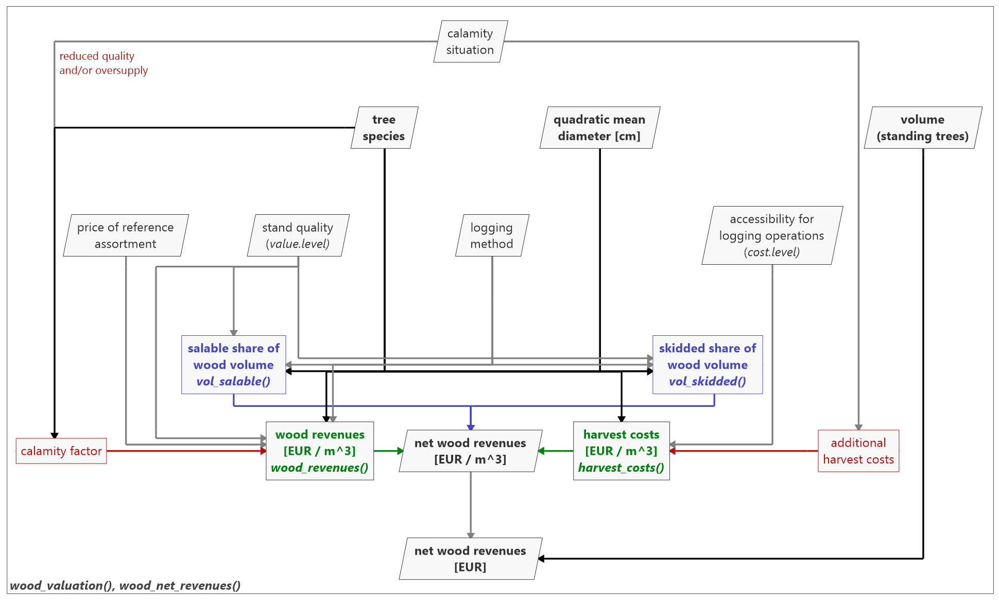

woodValuationDE
-------------------------------------------

Monetary valuation of standing wood with assortment, wood revenue, and harvest
costs functions sensitive to tree species, tree diameter, wood quality, harvest
procedure, and calamities.

<h1><a name="menu"></a></h1>
<ul>
  <li><a href="#introduction">Introduction</a></li>
  <li><a href="#structure">Package Structure</a></li>
  <li><a href="#functions">Functions</a></li>
  <ul>
    <a href="#fct_vol_salable"><li>vol_salable</li></a>
    <a href="#fct_vol_skidded"><li>vol_skidded</li></a>
    <a href="#fct_wood_revenues"><li>wood_revenues</li></a>
    <a href="#fct_harvest_costs"><li>harvest_costs</li></a>
    <a href="#fct_wood_valuation"><li>wood_valuation</li></a>
    <a href="#fct_wood_net_revenue"><li>wood_net_revenue</li></a>
    <a href="#fct_get_species_codes"><li>get_species_codes</li></a>
  </ul>
  <li><a href="#examples">Examples</a></li>
  <li><a href="#citation">Recommended Citation</a></li>
  <li><a href="#references">References</a></li>
</ul>


<h1><a name="introduction">Introduction</a></h1>

When assessing the multiple ecosystem services provided by Central European
forests, productive services are of importance. Forest owners, especially
private forest owners, will be interested in the monetary return generated by
wood production. Net revenues for wood depend, for example, on tree species, 
diameter, and stand quality, but also potential effects of disturbances on wood
quality and wood markets.

Here, <strong>woodValuationDE</strong> contributes with a comprehensive wood 
valuation model considering various influences on <em>assortment
structures</em>, <em>harvest costs</em> and <em>wood revenues</em>. It
simplifies the estimation of a realistic wood valuation for broad field of
bioeconomic applications. A particular strength of 
<strong>woodValuationDE</strong> is the consistency of the data underlying the
various models, including a set of different disturbance scenarios.

<strong>woodValuationDE</strong> compiles data and models derived several
studies but are consistent since all<sup>[1](#fndieter)</sup> based on
operational harvest and sale data of HessenForst, the forest administration of
the Federal State of Hesse in Germany. The underlying assortment tables are
taken from [Offer and Staupendahl (2018)](#offer.2018) with corresponding
functions for salable and skidded volume derived in
[Fuchs et al. (in preparation)](#fuchs.inpreparation). Wood revenue and harvest
cost functions were taken from
[von Bodelschwingh (2018)](#vonbodelschwingh.2018). The effects of calamities
refer to [Dieter (2001)](#dieter.2001)<sup>[1](#fndieter)</sup>,
[Fuchs et al. (under review)](#fuchs.underreview), and
[Fuchs et al. (in preparation)](#fuchs.inpreparation).

One should consider that the assortment tables, as well as the other models in
<strong>woodValuationDE</strong> represent average conditions. Thus, the
valuation estimated by <strong>woodValuationDE</strong> will likely differ from
the realized harvest values of single stands. Furthermore, the assortment tables
assume the harvest of entire stands, which will most likely lead to deviations
if only smaller parts of a stand are harvested. We thus recommend the
application mainly for harvests of larger parts or entire stands.

<i><sup><a id="fndieter">1</a></sup>The assumed calamity factor according to
[Dieter (2001)](#dieter.2001) is an exception since it is based on wood
prices in southern Germany. However, we included it since it has often been
applied in bioeconomic simulations for Germany.</i>


<h1><a name="structure">Package Structure</a></h1>

The wood valuation implemented in <strong>woodValueDE</strong> is a three-stage
approach, deriving (i) the relevant volume shares, (ii) the revenues and costs
per volume unit, and (iii) the net revenues (see Fig. 1).

<figure align="center">
  
  <figcaption>
    <i>Fig. 1:</i> Structural outline of <strong>woodValueDE</strong> with user
    input and output as well as the main functions. Font: bold: main elements,
    italics: functions. Color: blue: function derived in
    [Fuchs et al. (in preparation)](#fuchs.inpreparation) based on
    [Offer and Staupendahl (2018)](#offer.2018), green: functions taken from
    [von Bodelschwingh (2018)](#vonbodelschwingh.2018), red: calamity factors
    derived in [Dieter (2001)](#dieter.2001),
    [Fuchs et al. (under review)](#fuchs.underreview), and
    [Fuchs et al. (in preparation)](#fuchs.inpreparation). Box shape: rectangle:
    functions and factors, parallelogram: user input and output.
  </figcaption>
</figure>

&nbsp;<br>
We assume that the wood to be evaluated is measured as standing trees. Thus,
volume losses due to harvest cuts and not using e.g. the entire stem wood will
occur. For the valuation, <em>vol_salable()</em> provides the share of salable
wood volume, i.e. the volume that is utilized and taken out of the forest stand.
Only this volume share is relevant for the revenues. <em>vol_skidded()</em>
provides the skidded volume which is brought to the forest road. It is relevant
for remuneration for the harvest, i.e. the harvest costs. The salable volume is
higher as the skidded volume since it included the private fuel wood usage.

Accordingly, <em>wood_revenues()</em> estimates the revenues per unit volume of
salable wood [EUR m<sup>-3</sup>] and <em>harvest_costs()</em> the harvest costs
per unit volume of skidded wood [EUR m<sup>-3</sup>]. Both models depend on the
tree species and the quadratic mean of the diameter at breast height (dbh).
Further parameters are the stand quality, the type of harvest process and the
accessibility of the stand for harvest operations. In addition, current market
situations can be considered via a price correction.

The functions <em>wood_valuation()</em> and <em>wood_net_revenues()</em> provide
wrappers for easily applying the wood valuation procedure implemented in
<strong>woodValueDE</strong>. Both functions call the previously described ones
and combine them to derive the net wood revenues. While
<em>wood_valuation()</em> returns a tibble with the entire calculations, 
<em>wood_net_revenues()</em> can be used to directly get the total net revenues
[EUR].

In the next section, we describe the functions input and output as well as the
underlying models and data with their references in more detail. The parameters
for all models are stored as internal object <em>params.wood.value</em>. Users
interested in the detailed parameters can call them via:

``` r
woodValuationDE:::params.wood.value

```

<h1><a name="functions">Functions, Models, and Underlying Data</a></h1>

<h2><em><a name="fct_vol_salable">vol_salable</a></em></h2>

The function estimates the share of standing wood volume which is salable. This
includes e.g. industrial wood, sawing wood, but also private fuel wood. Thus,
it represents the share of wood that is taken out of the forest for usage.
The share of salable wood is required to derive the wood revenues per unit
standing volume. The function is based on the assortment tables of
[Offer and Staupendahl (2018)](#offer.2018) and its derivation is described in
[Fuchs et al. (in preparation)](#fuchs.inpreparation). The underlying assortment
tables are based on data of HessenForst, the forest administration of the
Federal State of Hesse in Germany.

<h3>Data and Model</h3>

The assortment tables of [Offer and Staupendahl (2018)](#offer.2018) provide the
total share of stem wood as well as the share of non-utilized wood and private
fuel wood thereof. The assortment tables were derived for HessenForst with the
calculation program Holzernte 7.1 [(Schöpfer et al., 2003)](#schopfer.2003)
using model stands, which were designed by a group of forestry experts, and 
harvest and sale data of HessenForst. More details on the assortment tables and
their derivation are provided in [Offer and Staupendahl (2008)](#offer.2008) and
[Offer and Staupendahl (2009)](#offer.2009).

Based on the assortment tables, we derived the salable volume share of the
standing trees. Since the assortment tables only provide the values in diameter
steps of 2 cm, a Gompertz functions was fitted in order to have a continuous
model (see [Fuchs et al., in preparation](#fuchs.inpreparation)). For the model
fitting, the modified formulation according to
[Fischer and Schoenfelder (2017)](#fischer.2017) was used:

<p align="center"><i>vol<sub>salable</sub></i> = <i>A</i> * exp( -exp(
  <i>z<sub>m</sub></i> / <i>A</i> * exp(1) * (<i>t<sub>w</sub></i> -
  <i>diameter.q</i>))),
</p>

with the quadratic mean diameter <i>diameter.q</i> and the parameters <i>A</i>,
<i>z<sub>m</sub></i> and <i>t<sub>w</sub></i>. This formulation provides
parameters that are easier to interpret, and simplifies the choice of starting
values.

<h3>Input</h3>

Apart from <i>species.code.type</i>, all user inputs can be provided as single
values or as a vector. If mixed, the single values will be recycled.

<h4><i>diameter.q</i></h4>

The quadratic mean of the diameter at breast height (dbh) of the harvested trees
[cm].

<h4><i>species</i></h4>

The tree species, using an available <i>species.code.type</i>.
<a href="#tab1">Tab. 1</a> lists the most important genera and species
implemented. Most species are assigned to economic species groups for the
valuation. A list of available species, codes, and their assignments to
valuation groups is provided by:
``` r
get_species_codes

```

&nbsp;<br>

<p align="center" id="tab1"><i>Tab. 1:</i> Most important species codes and
  genera available in <strong>woodValuationDE</strong> with their English and 
  Lower Saxony species codes.
</p>

| Species Code Lower Saxony	| English Species Code	| Scientific Name        |
| ------------------------- | --------------------- | ---------------------- |
| 110	                      | oak	                  | Quercus sp.            |
| 211	                      | beech	                | Fagus sylvatica        |
| 221	                      | hornbeam	            | Carpinus betulus       |
| 311	                      | ash	                  | Fraxinus exelsior      |
| 321	                      | maple	                | Acer pseudoplatanus    |
| 331	                      | elm	                  | Ulmus glabra           |
| 341	                      | lime	                | Tilia platyphyllos     |
| 354	                      | cherry	              | Prunus avium           |
| 410	                      | birch                 | Betula sp.             |
| 421	                      | alder	                | Alnus glutinosa        |
| 430	                      | poplar	              | Populus sp.            |
| 441	                      | willow	              | Salix sp.              |
| 511	                      | spruce	              | Picea abies            |
| 521	                      | fir	                  | Abies alba             |
| 611	                      | douglas.fir	          | Pseudotsuga menziesii  |
| 711	                      | pine	                | Pinus sylvestris       |
| 811	                      | larch	                | Larix decidua          |

<h4><i>value.level</i></h4>

Stand quality expressed as integer value of 1:3:
<ul>
  <li><i>1</i>: extraordinary high stand quality with high shares of wood 
      suitable for furniture</li>
  <li><i>2</i>: average quality</li>
  <li><i>3</i>: extraordinary low quality (e.g. trees with many thick branches
      or stands with massive ungulate damages)</li>
</ul>
The <i>value.levels</i> refer to the applied assortment tables
[(Offer and Staupendahl, 2018)](#offer.2018).

<h4><i>process.type</i></h4>

Type of harvest process:
<ul>
  <li><i>"manually"</i>: motor-manual harvest using a chain saw</li>
  <li><i>"harvester"</i>: highly mechanized harvest machines</li>
  <li><i>"combined"</i>: a combination of the previous types dependent on the
    mean diameter.</li>
</ul>
The process types "manually" and "harvester" refer to
[Offer and Staupendahl (2018)](#offer.2018) and
[von Bodelschwingh (2018)](#vonbodelschwingh.2018). Since e.g. for deciduous
species a maximum diameter of 40 cm is assumed for highly mechanized harvests, 
[Fuchs et al. (in preparation)](#fuchs.inpreparation) derived the type
<i>"combined"</i>. This refers to the combinations applied by
[von Bodelschwingh (2018)](#vonbodelschwingh.2018) in the harvest cost model,
assuming diameter-specific shares of motor-manual and highly mechanized
harvests:
<ul>
  <li>softwood species</li>
    <ul>
      <li><i>diameter.q</i> &le; 20 cm: 100 % <i>"harvester"</i>,</li>
      <li>20 cm < <i>diameter.q</i> < 50 cm: linear increase of
          <i>"manually"</i>, maximum 50 %,</li>
      <li>diameter.q</i> &ge; 50 cm: 50 % <i>"harvester"</i> and
          50 % <i>"manually"</i>.
    </ul>
  <li>deciduous species</li>
  <ul>
      <li><i>diameter.q</i> &le; 20 cm: 100 % <i>"harvester"</i>,</li>
      <li>20 cm < <i>diameter.q</i> < 40 cm: linear increase of
          <i>"manually"</i>, maximum 100 %,</li>
      <li>diameter.q</i> &ge; 40 cm: 100 % <i>"manually"</i>.
    </ul>
</ul>

<h4><i>species.code.type</i></h4>

The type of code in which <i>species</i> is given.
<ul>
  <li><i>"en"</i>: English species names</li>
  <li><i>"nds"</i>: numeric species codes used in Lower Saxony, Germany.</li>
</ul>
The list with the available species' codes is provided by:
``` r
get_species_codes

```

<h3>Output</h3>

A vector with relative shares of salable wood volume (absolute share, not
percentages).

<h3>Application</h3>

``` r
vol_salable(40,
            "beech")

# species codes Lower Saxony (Germany)
vol_salable(40,
            211,
            species.code.type = "nds")

# vector input
vol_salable(seq(20, 50, 5),
            "spruce")

vol_salable(rep(seq(20, 50, 10),
                2),
            rep(c("beech", "spruce"),
                each = 4))

vol_salable(rep(seq(20, 50, 10),
                2),
            rep(c("beech", "spruce"),
                each = 4),
            process.type = rep(c("manually", "harvester"),
                               each = 4))
```


<h2><em><a name="fct_vol_skidded">vol_skidded</a></em></h2>

The function estimates the share of standing wood volume which is skidded. This
is the share of salable volume, but excluding private fuel wood since this is
not commercially skidded. The share of skidded wood is required to derive the
harvest costs per unit standing volume. The function is based on the assortment
tables of [Offer and Staupendahl (2018)](#offer.2018) and its derivation is
described in [Fuchs et al. (in preparation)](#fuchs.inpreparation). The
underlying assortment tables are based on data of HessenForst, the forest
administration of the Federal State of Hesse in Germany.

<h3>Data and Model</h3>

The assortment tables of [Offer and Staupendahl (2018)](#offer.2018) provide the
total share of stem wood as well as the share of non-utilized wood and private
fuel wood thereof. The assortment tables were derived for HessenForst with the
calculation program Holzernte 7.1 [(Schöpfer et al., 2003)](#schopfer.2003)
using model stands, which were designed by a group of forestry experts, and 
harvest and sale data of HessenForst. More details on the assortment tables and
their derivation are provided in [Offer and Staupendahl (2008)](#offer.2008) and
[Offer and Staupendahl (2009)](#offer.2009).

Based on the assortment tables, we derived the skidded volume share of the
standing trees. Since the assortment tables only provide the values in diameter
steps of 2 cm, a Gompertz functions was fitted in order to have a continuous
model (see [Fuchs et al., in preparation](#fuchs.inpreparation)). For the model
fitting, the modified formulation according to
[Fischer and Schoenfelder (2017)](#fischer.2017) was used:

<p align="center"><i>vol<sub>salable</sub></i> = <i>A</i> * exp( -exp(
  <i>z<sub>m</sub></i> / <i>A</i> * exp(1) * (<i>t<sub>w</sub></i> -
  <i>diameter.q</i>))),
</p>

with the quadratic mean diameter <i>diameter.q</i> and the parameters <i>A</i>,
<i>z<sub>m</sub></i> and <i>t<sub>w</sub></i>. This formulation provides
parameters that are easier to interpret, and simplifies the choice of starting
values.

<h3>Input</h3>

Apart from <i>species.code.type</i>, all user inputs can be provided as single
values or as a vector. If mixed, the single values will be recycled.

<h4><i>diameter.q</i></h4>

<h4><i>species</i></h4>

<h4><i>value.level</i></h4>

<h4><i>process.type</i></h4>

<h4><i>species.code.type</i></h4>

For details see <a href="#fct_vol_salable">vol_salable</a>.

<h3>Output</h3>

A vector with relative shares of skidded wood volume (absolute share, not
percentages).

<h3>Application</h3>

``` r
vol_skidded(40,
            "beech")

# species codes Lower Saxony (Germany)
vol_skidded(40,
            211,
            species.code.type = "nds")

# vector input
vol_skidded(seq(20, 50, 5),
            "spruce")

vol_skidded(rep(seq(20, 50, 10),
                2),
            rep(c("beech", "spruce"),
                each = 4))

vol_skidded(rep(seq(20, 50, 10),
                2),
            rep(c("beech", "spruce"),
                each = 4),
            process.type = rep(c("manually", "harvester"),
                               each = 4))

```


<h2><em><a name="fct_wood_revenues">wood_revenues</a></em></h2>

The function estimates wood revenues per unit volume based on the assortment
tables of [Offer and Staupendahl (2018)](#offer.2018) and the wood revenue
function of [von Bodelschwingh (2018)](#vonbodelschwingh.2018). Consequences of
calamities are implemented based on [Dieter (2001)](#dieter.2001),
[Fuchs et al. (under review)](#fuchs.underreview) and
[Fuchs et al. (in preparation)](#fuchs.inpreparation). Apart from
[Dieter (2001)](#dieter.2001), the function and all factors are based on data of
HessenForst, the forest administration of the Federal State of Hesse in Germany.

<h3>Data and Model</h3>

The diameter- and species-sensitive wood revenue model was developed by
[von Bodelschwingh (2018)](#vonbodelschwingh.2018). It is based on a previous
version (2013) of the assortment tables of
[Offer and Staupendahl (2018)](#offer.2018) and the wood sales of HessenForst
from 2010 to 2015. A price matrix for different assortments was derived out of
the sales data and combined with the assortment table to derive mean wood
revenues over all assortments. The fitted model function is:

<p align="center"><i>revenues</i> = <i>a</i>
    * <i>diameter.q</i><sup>4</sup> + <i>b</i> * <i>diameter.q</i><sup>3</sup> +
    <i>c</i> * <i>diameter.q</i><sup>2</sup> + <i>d</i> * <i>diameter.q</i> +
    <i>e</i>,
</p>

with the quadratic mean diameter <i>diameter.q</i> and the parameters <i>a</i>
to <i>e</i>.

The model estimated wood revenues for the time period 2010 to 2015. Via a the
price of a reference assortment for each species, this can be adapted to other
years. The references assortments (saw wood) are defined by a diameter class 
(1: 10-19 cm, 2: 20-29..., with 1a: 10-14 cm and 1b: 15-19 cm) and a quality
of A to D (with A the highest and D the lowest quality) as usually applied in
German wood assortment. The original prices of the reference assortments in 
Hesse between 2010 and 2015 are listed in <a href="#tab12">Tab. 2</a>. If
another price is applied to <em>wood_revenues</em> the wood revenues will be
adapted by:

<p align="center"><i>revenues<sub>adapted</sub></i> =
    <i>price<sub>reference.assortment,user</sub></i> /
    <i>price<sub>reference.assortment,original</sub></i> *
    <i>revenues<sub>original</sub></i>.
</p>

&nbsp;<br>

<p align="center" id="tab2"><i>Tab. 2:</i> Prices of the reference assortments 
    in Hesse between 2010 and 2015, adapted from
    [von Bodelschwingh (2018, Tab. 10)](#vonbodelschwingh.2018).
</p>

| English Species Code | Reference Assortment	| Price [EUR ha<sup>-1</sup>]  |
| -------------------- | -------------------- | ---------------------------: |
| oak	                 | B 4	                | 277.41                       |
| beech	               | B 4	                |  75.75                       |
| spruce	             | B 2b	                | 92.47                        |
| pine	               | B 2b	                | 71.48                        |
| douglas.fir          | B 2b	                | 92.23                        |
| larch	               | B 2b	                | 83.29                        |
| birch	               | B 4	                | 72.13                        |
| alder	               | B 4	                | 98.90                        |
| ash	                 | B 4                  | 112.88                       |
| poplar	             | B 4	                | 45.43                        |

A special strength of <strong>woodValuationDE</strong> is the consideration of
consequences of calamities. A broad set of previously published and newly
derived quantitative effects of calamities is implemented. Additionally, user
can implement their own factors. For wood revenues, a calamity factor is
multiplied with the undisturbed revenues. The options are implemented by default
are listed in <a href="#tab3">Tab. 3</a>.

&nbsp;<br>

<p align="center" id="tab3"><i>Tab. 3:</i> Calamity factors to reduce the wood 
    revenues implemented in <strong>woodValuationDE</strong>.
</p>

| Name                             | Factor Softwood  | Factor Deciduous	| Reference | Details |
| ----- | -----: | -----: | --------- | --------------------------------------- |
| <i>"none"</i>	                   | 1.00	            | 1.00              | -         | default: no calamity | 
| <i>"calamity.dieter.2001"</i>	   | 0.50             | 0.50              | [Dieter (2001)](#dieter.2001) | Assumption based on prices in southern Germany after a calamity event, often applied in bioeconomic simulations for Germany. Originally referring to net revenues, thus to be used in combination with <i>harvest_costs</i>. |
| <i>"ips"</i>	                   | 0.67	            | -                 | [Fuchs et al. (under review)](#fuchs.underreview) | Assumption of quality losses after spruce bark beetle infestations, based on the assortment tables [(Offer and Staupendahl, 2018)](#offer.2018) and price index [(von Bodelschwingh, 2018)](#vonbodelschwingh.2018). |
| <i>"ips.timely"</i>	             | 0.88	            | -                 | [Fuchs et al. (under review)](#fuchs.underreview) | Assumption of quality losses after spruce bark beetle infestations with timely salvage harvests leading to lower value losses, based on the assortment tables [(Offer and Staupendahl, 2018)](#offer.2018) and price index [(von Bodelschwingh, 2018)](#vonbodelschwingh.2018). |
| <i>"stand.damage.fuchs"</i>      | 0.96	            | 0.81              | [Fuchs et al. (in preparation)](#fuchs.inpreparation) | Assumption of damages in a single stand influencing only the wood quality not the wood market, derived based on time series analyses of sales of HessenForst. |
| <i>"regional.calamity.fuchs"</i> | 0.68	            | 0.76              | [Fuchs et al. (in preparation)](#fuchs.inpreparation) | Assumption of regional damages influencing wood quality and regional wood market (oversupply), derived based on time series analyses of sales of HessenForst. |
| <i>"national.calamity.fuchs"</i> | 0.43             | 0.61              | [Fuchs et al. (in preparation)](#fuchs.inpreparation) | Assumption of (inter-)national damages influencing wood quality and wood national market (oversupply), derived based on time series analyses of sales of HessenForst. |


<h3>Input</h3>

Apart from <i>species.code.type</i>, <i>price.ref.assortment</i>, and
<i>calamity.factors</i>, all user inputs can be provided as single
values or as a vector. If mixed, the single values will be recycled.

<h4><i>diameter.q</i></h4>

The quadratic mean of the diameter at breast height (dbh) of the harvested trees
[cm].

<h4><i>species</i></h4>

The tree species, using an available <i>species.code.type</i>.
<a href="#tab1">Tab. 1</a> lists the most important genera and species
implemented. Most species are assigned to economic species groups for the
valuation. A list of available species, codes, and their assignments to
valuation groups is provided by:
``` r
get_species_codes

```

<h4><i>value.level</i></h4>

Stand quality expressed as integer value of 1:3:
<ul>
  <li><i>1</i>: extraordinary high stand quality with high shares of wood 
      suitable for furniture</li>
  <li><i>2</i>: average quality</li>
  <li><i>3</i>: extraordinary low quality (e.g. trees with many thick branches
      or stands with massive ungulate damages)</li>
</ul>
The <i>value.levels</i> refer to the applied assortment tables
[(Offer and Staupendahl, 2018)](#offer.2018).

<h4><i>process.type</i></h4>

Type of harvest process:
<ul>
  <li><i>"manually"</i>: motor-manual harvest using a chain saw</li>
  <li><i>"harvester"</i>: highly mechanized harvest machines</li>
  <li><i>"combined"</i>: a combination of the previous types dependent on the
    mean diameter.</li>
</ul>
The process types "manually" and "harvester" refer to
[Offer and Staupendahl (2018)](#offer.2018) and
[von Bodelschwingh (2018)](#vonbodelschwingh.2018). Since e.g. for deciduous
species a maximum diameter of 40 cm is assumed for highly mechanized harvests, 
[Fuchs et al. (in preparation)](#fuchs.inpreparation) derived the type
<i>"combined"</i>. This refers to the combinations applied by
[von Bodelschwingh (2018)](#vonbodelschwingh.2018) in the harvest cost model,
assuming diameter-specific shares of motor-manual and highly mechanized
harvests:
<ul>
  <li>softwood species</li>
    <ul>
      <li><i>diameter.q</i> &le; 20 cm: 100 % <i>"harvester"</i>,</li>
      <li>20 cm < <i>diameter.q</i> < 50 cm: linear increase of
          <i>"manually"</i>, maximum 50 %,</li>
      <li>diameter.q</i> &ge; 50 cm: 50 % <i>"harvester"</i> and
          50 % <i>"manually"</i>.
    </ul>
  <li>deciduous species</li>
  <ul>
      <li><i>diameter.q</i> &le; 20 cm: 100 % <i>"harvester"</i>,</li>
      <li>20 cm < <i>diameter.q</i> < 40 cm: linear increase of
          <i>"manually"</i>, maximum 100 %,</li>
      <li>diameter.q</i> &ge; 40 cm: 100 % <i>"manually"</i>.
    </ul>
</ul>

<h4><i>price.ref.assortment</i></h4>

Wood price of the reference assortments allowing to consider market fluctuations
as described above. Default is <i>"baseline"</i> referring to the prices from
2010 to 2015 in Hesse, Germany according to
[von Bodelschwingh (2018)](#vonbodelschwingh.2018), listed in
<a href="#tab2">Tab. 2</a>. Alternatively, it can be user-provided tibble with
the same structure, illustrated by the default tibble:
``` r
prices.ref.assortments <- dplyr::tibble(
      species = c(110, 211, 511, 711, 611,
                  811, 410, 421, 311, 430),
      price.ref.assortment = c(277.41, 75.75, 92.47, 71.48, 92.23,
                               83.29, 72.13, 98.90, 112.88, 45.43))
```

<h4><i>calamity.type</i></h4>

Type of a potential calamity determining the applied calamity corrections, which
implement reduced returns (and higher harvest costs). For the implemented
options described above see <a href="#tab3">Tab. 3</a>. Alternatively, users can
provide their own factors.

<h4><i>calamity.factors</i></h4>

Summands [EUR m^(-3)] and factors to consider the consequences of calamities on
wood revenues and harvest costs. "baseline" provides a tibble based on the
references listed in calamity.type (for details see readme of woodValuationDE).
Alternatively, users can provide an own tibble with the same structure,
illustrated by the default tibble:
``` r
calamity.factors <- dplyr::tibble(
      calamity.type = rep(c("none",
                            "calamity.dieter.2001",
                            "ips",
                            "ips.timely",
                            "stand.damage.fuchs",
                            "regional.calamity.fuchs",
                            "national.calamity.fuchs"),
                          each = 2),
      species.group = rep(c("softwood",
                            "deciduous"),
                          times = 7),
      revenues.factor = c(1.00, 1.00,
                          0.50, 0.50,
                          0.67,   NA,
                          0.88,   NA,
                          0.96, 0.81,
                          0.68, 0.76,
                          0.43, 0.61),
      cost.factor = c(1.00, 1.00,
                      0.50, 0.50,
                      1.00,   NA,
                      1.00,   NA,
                      1.00, 1.00,
                      1.00, 1.00,
                      1.00, 1.00),
      cost.additional = c(0.0, 0.0,
                          0.0, 0.0,
                          2.5,  NA,
                          2.5,  NA,
                          2.0, 2.0,
                          2.5, 2.5,
                          5.0, 5.0)
    )
```

<h4><i>species.code.type</i></h4>

The type of code in which <i>species</i> is given.
<ul>
  <li><i>"en"</i>: English species names</li>
  <li><i>"nds"</i>: numeric species codes used in Lower Saxony, Germany.</li>
</ul>
The list with the available species' codes is provided by:
``` r
get_species_codes

```

<h3>Output</h3>

A vector with wood revenues per unit volume [EUR m<sup>-3</sup>]. The volume
refers to the salable wood volume, provided by <i>vol_salable</i>.

<h3>Application</h3>

``` r
wood_revenues(40,
              "beech")

# species codes Lower Saxony (Germany)
wood_revenues(40,
              211,
              species.code.type = "nds")

# vector input
wood_revenues(seq(20, 50, 5),
              "spruce")

wood_revenues(40,
              rep(c("beech", "spruce"),
                  each = 3),
              value.level = rep(1:3, 2))

# with calamity
wood_revenues(40,
              rep("spruce", 7),
              calamity.type = c("none",
                                "calamity.dieter.2001",
                                "ips",
                                "ips.timely",
                                "stand.damage.fuchs",
                                "regional.calamity.fuchs",
                                "national.calamity.fuchs"))

# user-defined calamities with respective changes in wood revenues
wood_revenues(40,
              rep("spruce", 3),
              calamity.type = c("none",
                                "my.own.calamity.1",
                                "my.own.calamity.2"),
              calamity.factors = dplyr::tibble(
                calamity.type = rep(c("none",
                                      "my.own.calamity.1",
                                      "my.own.calamity.2"),
                                    each = 2),
                species.group = rep(c("softwood",
                                      "deciduous"),
                                    times = 3),
                revenues.factor = c(1.0, 1.0,
                                    0.8, 0.8,
                                    0.2, 0.2),
                cost.factor = c(1.0, 1.0,
                                1.5, 1.5,
                                1.0, 1.0),
                cost.additional = c(0, 0,
                                    0, 0,
                                    5, 5)))

# adapted market situation by providing alternative prices for the reference assortments
wood_revenues(40,
              c("oak", "beech", "spruce"))
wood_revenues(40,
              c("oak", "beech", "spruce"),
              price.ref.assortment = dplyr::tibble(
                species.code = c(110, 211, 511),
                price.ref.assortment = c(300, 80, 50)))

```


<h2><em><a name="fct_harvest_costs">harvest_costs</a></em></h2>

The function estimates harvest costs per unit wood volume applying the harvest
costs function of [von Bodelschwingh (2018)](#vonbodelschwingh.2018).
Consequences of calamities are implemented based on
[Dieter (2001)](#dieter.2001), [Fuchs et al. (under review)](#fuchs.underreview)
and [Fuchs et al. (in preparation)](#fuchs.inpreparation).

<h3>Data and Model</h3>

The diameter- and species-sensitive harvest cost model was developed by
[von Bodelschwingh (2018)](#vonbodelschwingh.2018). It is based on data from
[KWF (2006)](#kwf.2006) and [AFL (2014)](#afl.2014). The fitted model function
is:

<p align="center"><i>costs</i> = max(<i>a</i> * <i>diameter.q</i><sup>b</sup> +
  <i>c</i>, <i>cost<sub>max</sub></i>),
</p>

with the quadratic mean diameter <i>diameter.q</i> and the parameters <i>a</i>
to <i>c</i> and the maximum costs <i>cost<sub>max</sub></i>.


#### hier weiter


<h3>Input</h3>
<h3>Output</h3>
<h3>Application</h3>

<h2><em><a name="fct_wood_valuation">wood_valuation</a></em></h2>
<h3>Data and Model</h3>
<h3>Input</h3>
<h3>Output</h3>
<h3>Application</h3>

<h2><em><a name="fct_wood_net_revenue">wood_net_revenue</a></em></h2>
<h3>Data and Model</h3>
<h3>Input</h3>
<h3>Output</h3>
<h3>Application</h3>

<h2><em><a name="fct_get_species_codes">get_species_codes</a></em></h2>
<h3>Data and Model</h3>
<h3>Input</h3>
<h3>Output</h3>
<h3>Application</h3>

Modelle + zugrundeliegende Daten
Quellen


<h1><a name="examples">Examples</a></h1>


``` r


```

<h1><a name="citation">Recommended Citation</a></h1>


<h1><a name="references">References</a></h1>

<a id="afl.2014">AfL</a> (ed.) (2014): AfL-Info 2014/15. Richtpreise, Tarife,
Kalkulationen, Adressen. [Reference prices, tariffs, calculations, addresses].
AfL Niedersachsen e.V. <em>Hannover: Deutscher Landwirtschaftsverlag</em>.

<a id="dieter.2001">Dieter</a>, Matthias (2001): Land expectation values for
spruce and beech calculated
with Monte Carlo modelling techniques. <em>For. Policy Econ.</em> **2 (2)**,
S. 157-166. https://doi.org/10.1016/S1389-9341(01)00045-4.

<a id="fischer.2017">Fischer</a>, Christoph; Schoenfelder, Egbert (2017): A
modified growth function with interpretable parameters applied to the age–height
relationship of individual trees. <em>Can. J. For. Res.</em> **47**, S. 166–173.
https://doi.org/10.1139/cjfr-2016-0317.

<a id="fuchs.underreview">Fuchs</a>, Jasper M., Hittenbeck, Anika, Brandl,
Susanne, Schmidt, Matthias, Paul, Carola (under review): Adaptation Strategies
for Spruce Forests - Economic Potential of Bark Beetle Management and Douglas
Fir Cultivation in Future Tree Species Portfolios.

<a id="fuchs.inpreparation">Fuchs</a>, Jasper M., von Bodelschwingh, Hilmar,
Paul, Carola, Husmann, Kai (in preparation): Applying Time Series Analysis to
Quantify the Impact of Quality and Supply Changes After Disturbances on Wood
Revenues.

<a id="kwf.2006">KWF</a> (ed.) (2006): Holzernteverfahren - Vergleichende
Erhebung und Beurteilung, Daten CD mit Beschreibung der Ernteverfahren und
Kalkulationen. [Wood harvesting methods - Comparative survey and assessment,
data CD with description of harvesting methods and calculations.].
<em>Groß-Umstadt: KWF.</em>

<a id="offer.2008">Offer</a>, Armin; Staupendahl, Kai (2008): Neue
Bestandessortentafeln für die Waldbewertung und ihr Einsatz in der
Bewertungspraxis. [New stand assortment tables for forest valuation and their
application in valuation practice.]. <em>Wertermittlungsforum</em> **26 (4)**,
S. 146-154.

<a id="offer.2009">Offer</a>, Armin; Staupendahl, Kai (2009): Neue
Bestandessortentafeln für die Waldbewertung und ihr Einsatz in der
Bewertungspraxis. [New stand assortment tables for forest valuation and their
application in valuation practice.]. <em>Forst und Holz</em> **64 (5)**,
S. 16–25.

<a id="offer.2018">Offer</a>, Armin and Staupendahl, Kai (2018):
Holzwerbungskosten- und Bestandessortentafeln (Wood Harvest Cost and Assortment
Tables). <em>Kassel: HessenForst (publisher)</em>.

<a id="schopfer.2003">Schoepfer</a>, W., Kaendler, G., Stoehr, D. (2003):
Entscheidungshilfen für die Forst- und Holzwirtschaft - Zur Abschlussversion von
HOLZERNTE. [Decision Support for Forestry and Wood Industry - The Final Version
of HOLZERNTE]. <em>Forst und Holz</em> **58 (18)**, S. 545–550.

<a id="vonbodelschwingh.2018">von Bodelschwingh</a>, Hilmar (2018): Oekonomische
Potentiale von Waldbestaenden. Konzeption und Abschaetzung im Rahmen einer
Fallstudie in hessischen Staatswaldflaechen [Economic Potentials of Forest
Stands and Their Consideration in Strategic Decisions]. <em>Bad Orb: J.D.
Sauerlaender`s Verlag (Schriften zur Forst- und Umweltoekonomie, 47)</em>.
